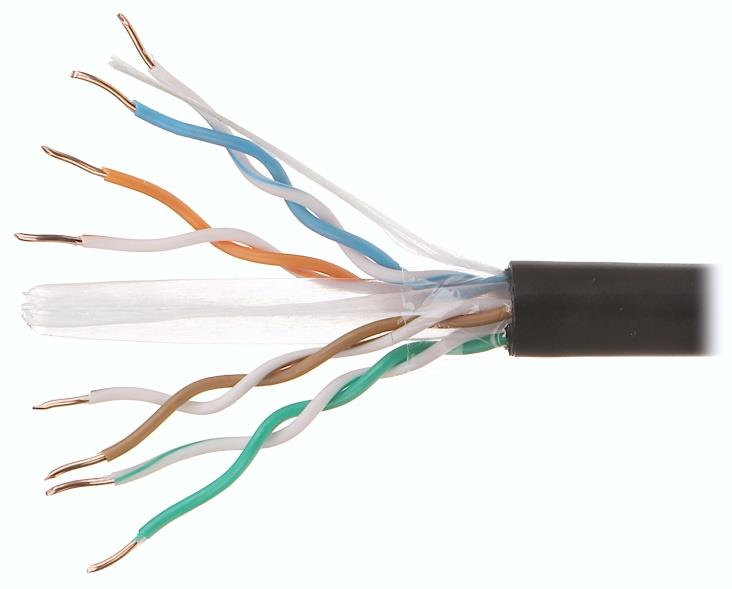
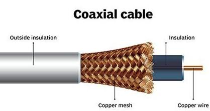
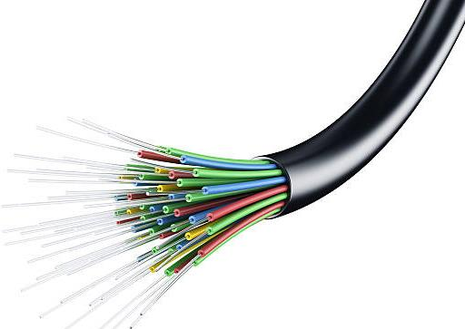
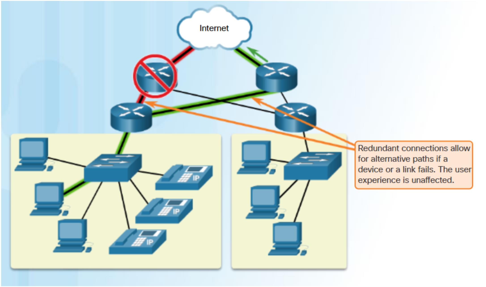
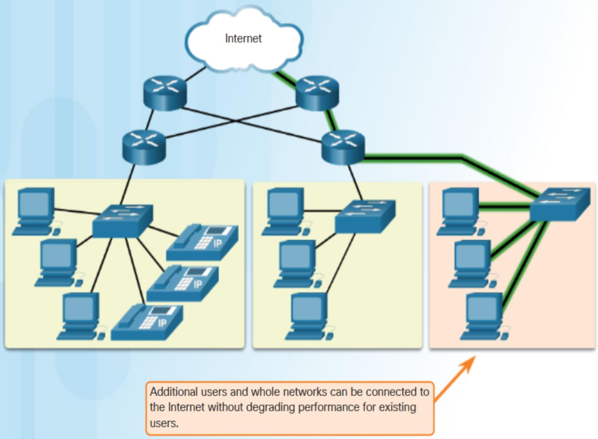
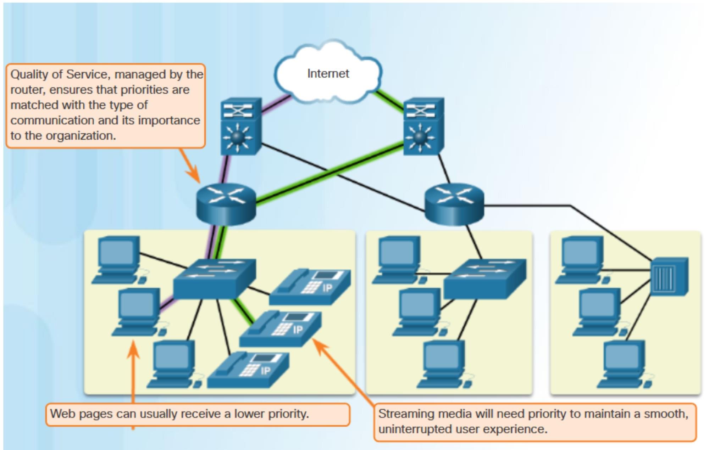
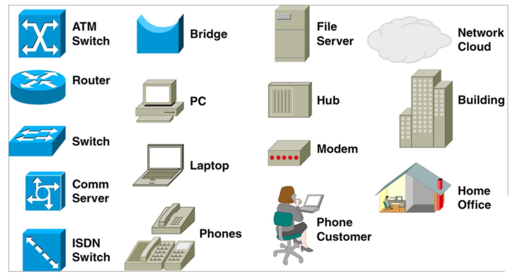

# Week1

# **1、什么是计算机网络？**

Computer network refers to interconnected computing devices that can exchange data and  share resources with each other.

能相互交换数据和共享资源的相互连接的计算设备

These networked devices use a system of rules, called  communications protocols, to transmit information over physical or wireless technologies.

使用通信协议，通过物理或者无线技术传输信息

# 2、使用计算机网络的优点(Advantages of utilizing Computer Networks）

1. File sharing: It enables users to share data between users. 文件共享
2. Resource sharing: It enables users to share multiple devices, such as copiers and printers. 资源共享
3. Communication: It enables users to send and receive messages and data in real time from  multiple devices. 交流
4. Convenience in that data is accessible through an internet connection. 便捷性
5. Cost in that there are reduced hardware costs since networked devices can share resources 网络设备共享资源，降低硬件成本
6. Storage: It enables users to access data that's stored remotely or on other network devices.允许用户访问远程或在其他网络设备上的数据

# 3、计算机网络需求：

1. To share computer equipment 共享计算机设备

2. To enable unlike computer equipment to communicate 通信

3. To improve communication speed and accuracy 提高通信速度及准确性

4. To reduce the cost of data transfer 降低数据传输成本

5. Verify Data Transfer at any occurrence of time 随时验证数据传输

6. High reliability 高可靠性

# 4、计算机网络应用：

1. 市场营销及销售 Marketing and sales: Computer networks are widely used in both marketing and sales firms. These are used by marketing professionals to collect, exchange, and analyzes data relating to customer requirements and product development cycles.

2. 制造业 Manufacturing: computer-assisted manufacturing (CAM) and computer–assisted designing (CAD) permit multiple users to work on a project simultaneously.
3. 金融服务 Financial Services: Main applications are credit history searches, foreign exchange and investment services, and Electronic Funds Transfer (EFT) that permits a user to transfer money without going into bank.
4. 电话会议 Teleconferencing: Applications include simple text conferencing, voice conferencing, and video conferencing.
5. 电子信息 Electronic Messaging: Electronic mail (e-mail) is the most widely used network application

# 5、Network Component

## (1)Network interface card(NIC)网卡

NIC is a device that helps the computer to communicate with another device. The network interface card contains the hardware addresses, the data-link layer protocol use this address to identify the system on the network so that it transfers the data to the correct destination.网卡包含该硬件地址，数据链路层协议使用该地址识别网络上的系统

There are two types of NIC: wireless NIC and wired NIC.

Wireless NIC: All the modern laptops use the wireless NIC. In Wireless NIC, a connection is made using the antenna that employs the radio wave technology.无线网卡 无线电波技术

Wired NIC: Cables use the wired NIC to transfer the data over the medium 有线网卡 电缆在介质上传数据

## (2)Hub 集线器

Hub is a central device that splits the network connection into multiple devices. When computer requests for information from a computer, it sends the request to the Hub. Hub distributes this request to all the interconnected computers 将网络连接分成多个设备，集线器会获取计算机请求，并将该请求发送给所有相互连接的计算机

## (3)Switches 交换机

Switch is a networking device that groups all the devices over the network to transfer the data to another device. A switch is better than Hub as it does not broadcast the message over the network, i.e., it sends  the message to the device for which it belongs to. Therefore, we can say that switch sends the message  directly from source to the destination.通过网络将所有设备进行分组，将数据传输到另一个设备。交换机不会像集线器一样通过网络广播信息，而是将信息直接发送到相应设备。

## (4)Cable 电缆

Cable is a transmission media that transmits the communication signals

**双绞线** Twisted pair cable: It is a high-speed cable that transmits the data over 1Gbps or more.速度可达 1Gbps

**同轴电缆 Coaxial cable**: Coaxial cable resembles like a TV installation cable. Coaxial cable is more expensive than twisted pair cable, but it provides the high data transmission speed

同轴电缆比双绞线贵，数据传输速度高

**光纤电缆 Fibre optic cable**: Fibre optic cable is a high-speed cable that transmits the data using light beams. It provides high data transmission speed as compared to other cables. It is more expensive as compared to other cables, so it is installed at the government level.是一种利用光传输的电缆，具有较高的传输速度，成本较高，在政府级别安装

## (4.1)Connector 连接器

To join two network cables or to connect a network cable to a NIC, you need appropriate connectors. 连接电缆到网卡

There are numerous connectors which include:

1. Barrel connectors:used to connect coaxial cables. Also barrel connectors that are used to connect STP or  UTP cables are known as Ethernet LAN jointers or couplers.

   用于连接同轴电缆。连接 STP 或 UTP 电缆的桶状连接器也被称为以太网 LAN 接头或耦合器。
2. RJ-11 Connectors: have the capacity for six small pins but in most cases, only two pins eg a standard  telephone connection or four pins ( a DSL modem connection) are used.  有六个小针脚，在大多数情况下只是用两个针脚
3. Universal serial bus (USB) connectors: They are the most popular and support 127 devices in the series.  Most devices connected to the system have USB ports eg printers, keyboards, 					mobile phones, etcUSB 连接器应用最广，支持 127 个设备。大多数连接的设备都有 USB 端口

## (5)Modem

Modem connects the computer to the internet over the existing telephone line. A modem is  not integrated with the computer motherboard. A modem is a separate part on the PC slot  found on the motherboard 没有与主板集成

## (6)Router 路由器

Router is a device that connects the LAN to the internet. The router is mainly used to connect the  distinct networks or connect the internet to multiple computers.联机局域网到互联网的设备，用于连接不同的网络或连接互联网到多台计算机

# 5、可靠网络的特征 Characteristics of a Reliable Network

## (1)容错性 Fault Tolerance

A fault tolerant network is one that limits the impact of a failure, so that the fewest number of devices are affected. It is also built in a way that allows quick recovery when such a failure occurs. These networks depend on multiple paths between the source and destination of a m essage. If one path fails, the messages can be instantly sent over a different link. Having multiple paths to a destination is known as redundancy

## (2)可量测性 Scalability

A scalable network can expand quickly to support new users and applications without impacting the performance of the service being delivered to existing users.

## (3)Quality of Service

When the volume of traffic is greater than what can be transported across the network, devices queue, or hold, the packets in memory until resources become available to transmit them. In the figure, one user is requesting a web page and another is on a phone call. With a QoS policy in place, the router can manage the flow of data and voice traffic, giving priority to voice communications if the network experiences congestion.

## (4)Security

 Securing a network infrastructure includes the physical securing of devices that provide network connectivity, and preventing unauthorized access to the management software that resides on them.

# 6、Network Infrastructure devices and their Icons

# 7、Client Operating System and Network Operating System

## (1)Client Operating System (OS)

This type works within computer desktops and other portable devices such as laptops and smartphones.  Operating systems that are installed on the client’s computer device like PC, Laptop are called client OS.  		Examples are Windows, Mac

Other Features:

• It manages different hardware components that are connected to printers, monitors and cameras

• It supports a single user at a time.

• It is also capable of obtaining services from a server operating system.

• Unlike server operating system, it helps in providing multiprocessing power for a minimum price.

## (2)Server Operating System

This types operates on the server and it is an advanced version of an operating  system which has more  features and capabilities to provide various services to other devices connected  to it.

Also, most processes execute from the OS commands. It helps to install  and deploy business and web applications and is also  capable of managing and monitoring the connected client devices. The server  operating systems execute other administrative processes

# 8、Responsibilities of a Network Engineer

The responsibilities of a network Engineer include the following;

* Configure and install various network devices and services (e.g., routers, switches, firewalls , load balancers, VPN, QoS).
* Perform network maintenance and system upgrades including service packs, patches, hot  fixes and security configurations.
* Monitor performance and ensure system availability and reliability.
* Monitor system resource utilization, trending, and capacity planning.
* Provide Level-2/3 support and troubleshooting to resolve issues.
* Work within established configuration and change management policies to ensure awareness, approval and success of changes made to the network infrastructure.
* Select and implement security tools, policies, and procedures in conjunction with the  company’s security team.
* Liaise with vendors and other IT personnel for problem resolution
