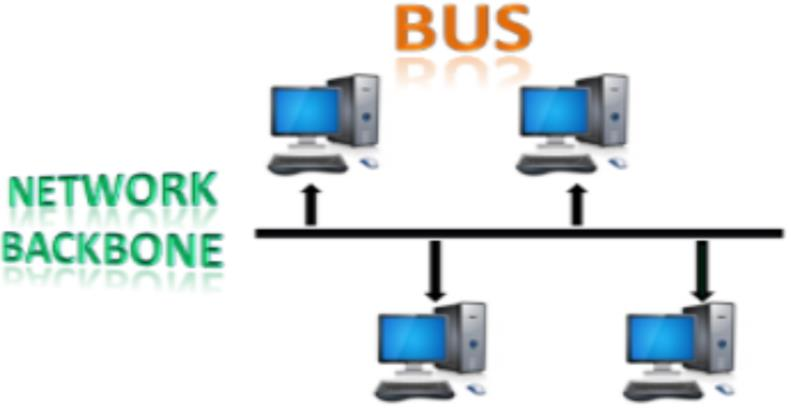

# Week2:Network Media, Topologies and Security

# 1.Transmission Modes

* The way in which data is transmitted from one device to another device is called as **transmission mode** or **communication mode**.传输模式或通信模式的定义

* Each communication channel has a direction associated with it, and transmission media provide the direction.

* The transmission mode is defined in the physical layer.

* The Transmission mode is divided into three categories:

  * Simplex mode
  * Half-duplex mode
  * Full-duplex mode

## 1.1 Simplex Mode单工模式

* In Simplex mode, the communication is unidirectional, i.e., the data flow in one direction.单向数据流

* A device can only send the data but cannot receive it or it can receive the data but cannot send the data.

  设备只能发送数据而不能接收数据，或者只能接收数据不能发送数据

* This transmission mode is not very popular as mainly communications require the two-way exchange of data. The simplex mode is used in the business field as in sales that do not require any corresponding reply.  
  主要的通信需要双向的数据交换

* The radio station is a simplex channel as it transmits the signal to the listeners but never allows them to transmit back.

* Good example of a simplex mode are Keyboard and Monitor, as a keyboard can only accept the data from the user and monitor can only be used to display the data on the screen.例子：显示屏，键盘

### 1.1.1 Advantages and Disadvantages of Simplex Mode

* Advantages of Simplex Mode

  The main advantage of the simplex mode is that the station can utilize the entire  bandwidth (full capacity) of the communication channel, so that more data can be transmitted  at a time  
  利用全部带宽，一次可以传输更多数据
* Disadvantages of Simplex Mode

  Communication is unidirectional, so it has no inter-communication between devices.  
  设备间无相互通信

## 1.2 Half-duplex Mode半双工信道

* In a Half-duplex channel, direction can be reversed, i.e., the station can transmit and receive the data as well.

  两端设备之间有一个共用的信道，但只有一端能发送信息，另一端能接收信息。

* Messages flow in both the directions, but not at the same time.

* The entire bandwidth of the communication channel is utilized in **one direction** at a time.

* In half-duplex mode, it is possible to perform the error detection, and if any error occurs, then the receiver requests the sender to retransmit the data.

  可执行错误检测，如果发生错误，接收方可请求发送方重新传输数据

* A **Walkie-talkie** is an example of the Half-duplex mode. In Walkie-talkie, one party speaks, and another party listens. After a pause, the other speaks and first party listens. Speaking simultaneously will create the distorted sound which cannot be understood.

  ig:对讲机

### 1.2.1 Advantages and Disadvantages of Half-duplex Mode

* Advantages of Half-duplex Mode

  In half-duplex mode, both the devices can send and receive the data and also can utilize the entire bandwidth of the communication channel during the transmission of data

  两个设备可以发送和接受数据，也能利用整个信道的带宽
* Disadvantages of Half-duplex Mode

  In half-duplex mode, when one device is sending the data, then another has to wait, this causes the delay in sending the data at the right time.  
  两端都需要等待对方完成信息传输才能进行下一次传输

## 1.3 Full-duplex Mode全双工模式

* In Full duplex mode, the communication is bi-directional, i.e., the data flow in both the directions.

  两个方向上的数据流

* Both the stations can send and receive the message simultaneously.

  两段可同时发送和接受数据

* Full-duplex mode has two simplex channels. One channel has traffic moving in one direction, and another channel has traffic flowing in the opposite direction.有两个单工通道，两个通道流量方向相反

* The Full-duplex mode is the fastest mode of communication between devices.是设备间最快的通信方式

* The most common example of the full-duplex mode is a telephone network. When two people are communicating with each other by a telephone line, both can talk and listen at the same time.

  电话网络：同时交流和接受信息

### 1.3.1 Advantages and Disadvantages of Full-duplex Mode

* Advantages of Full-duplex Mode

  Both the stations can send and receive the data at the same time.
* Disadvantages of Full-duplex Mode

  If there is no dedicated path exists between the devices, then the capacity of the communication channel is divided into two parts.设备间不存在专用路径，则通信信道的容量分为两部分

# 2.Network Media

Communication across a network is carried through a medium which allows a message to travel from source to destination.

|Mdiea Type|Description|
| ------------------------------| ------------------------------|
|Metal wires within cables|Uses electrical impules|
|Glass or plastic fibers within cables (fiber-optic cable)|Uses pulses of light|
|**Wireless transmission**|Uses modulation of specific frequencies of electromagnetic waves.|

# 3.Types of Computer Networks

A computer network is a collection of connected computers that allows computer to share resources, data, and software with another computer. A computer network can be classify by their size.

They are mainly four types of computer networks which are;

* Local Area Network (LAN)

* Personal Area Network (PAN)

* Metropolitan Area Network (MAN)

* Wide Area Network (WAN)

## 3.1 Local Area Network (LAN)局域网

* LAN is a group of computers connected to each other in a small area such as building, office.

  小区域内相互连接的计算机

* LAN is used for connecting two or more personal computers through a communication medium such as twisted pair, coaxial cable, etc.

  可通过双绞线，同轴电缆等连接两台或多台个人计算机

* It is less costly as it is built with inexpensive hardware such as hubs, network adapters, and ethernet cables.

  成本低廉，使用廉价硬件

* In LAN, data transfer rate is extremely faster and provides higher security.

  数据传输速度快，安全性高

## 3.2 Personal Area Network (PAN)个人区域网络

* PAN is arranged within an individual person, typically within a range of 10 meters.

* PAN is used for connecting the computer devices of personal use.

  用于连接个人使用的设备

* **Thomas Zimmerman** was the first research scientist to bring the idea of the PAN.

  **Thomas Zimmerman第一个提出PAN的概念**

* Personal Area Network covers an area of **30 feet**.

  覆盖面积30英尺

* Personal computer devices that are used to develop the PAN are the laptop, mobile phones, media player and play stations.

* It could be in form of wired or wireless PAN.

## 3.3 Metropolitan Area Network (MAN)城域网

* MAN covers a larger geographic area by interconnecting a different LAN to form a larger network.

  连接不同局域网，形成更大的网络

* Government agencies use MAN to connect to the citizens and private industries.

* In MAN, various LANs are connected to each other through a telephone exchange line.

  局域网通过电话交换线相互连接

* The most widely used protocols in MAN are RS-232, Frame Relay, ATM, ISDN, ADSL, etc.

* It has a higher range than LAN.

## 3.4 Wide Area Network (WAN)广域网

* WAN extends over a large geographical area such as states or countries.

* WAN is quite bigger network than the LAN.

* WAN is not limited to a **single location**, but it spans over a **large geographical area** through a telephone line, fibre optic cable or satellite links.

* The internet is one of the biggest WAN in the world.

* WAN is widely used in the field of Business, government, and education.

# 4.Internetwork

## 4.1 Internet/Internetwork

It is a network of networks. It is the largest network in existence on this planet. The internet hugely connects all WANs and it can have connection to LANs and Home networks. Internet uses TCP/IP protocol suite and uses IP as its addressing protocol. It is widely implemented using IPv4 but migrating to IPv6 due to shortage of address spaces.

## 4.2 Types of Internetwork

1. Extranet

    This is an intranet for outside authorized users using the same internet technology. It enables outsiders to work together with company’s employees with their given login credentials
2. Intranet

    An intranet belongs to an organization which is only accessible by the organization's employee or  members. The main aim of the intranet is to share the information and resources among the  organization employees. An intranet provides the facility to work in groups and for teleconferences.

# 5.Computer Network Topologies

## 5.1What is Network Topology?

Topology defines the structure of the network of how all the components are interconnected to each other.拓扑定义  
There are two types of topology: physical and logical topology.物理及逻辑拓扑  
Physical topology is the geometric representation of all the nodes in a network whereas the logical topology defines the architecture of the communication mechanism for all nodes in a network.

​​

## 5.2 Bus Topology总线拓扑

* In this topology, all stations/devices are connected through a single cable called a **backbone cable.**

* When a node wants to send a message over the network, it puts a message over the network. All the stations available in the network will receive the message whether it has been addressed or not.

  当节点需要发送消息时，无论是否已经寻址，网络中可用的站都会收到消息

* The configuration of a bus topology is quite simpler as compared to other topologies.

* The most common access method of the bus topologies is CSMA (Carrier Sense Multiple Access).

  CSMA是最简单的访问方法

### 5.2.1 Carrier Sense Multiple Access (CSMA)载波侦听多路访问

> *载波侦听多路访问（Carrier Sense Multiple Access, CSMA）是一种无线局域网（WLAN）中常用的多路访问控制方式。它是基于载波侦听（Carrier Sense）原理的，即在发送数据之前，先检测信道是否被占用，如果信道空闲，则发送数据，否则等待信道空闲后再发送。这种方式可以有效避免信号冲突，提高数据传输效率。*
>
> 									——ChatGPT

**CSMA** is a media access control used to control the data flow so that data integrity is maintained, i.e., the packets do not get lost. There are two alternative ways of handling the problems that occur when two nodes send the messages simultaneously.控制数据流，保持数据完整性

**CSMA CD**: CSMA CD (**Collision detection**) is an access method used to detect the collision. Once the collision is detected, the sender will stop transmitting the data. Therefore, it works on "**recovery after the collision**".  
碰撞检测，一旦检测到冲突，发送方将停止传输数据

> *CSMA/CD (Carrier Sense Multiple Access with Collision Detection)是一种基于载波侦听（Carrier Sense）和碰撞检测（Collision Detection）原理的多路访问控制方式。它在发送数据之前，先检测信道是否被占用。如果信道空闲，则发送数据；如果信道被占用，则等待信道空闲后再发送。如果在发送过程中发现碰撞（Collision），即两个或多个设备同时发送数据，则进行重传。*
>
> ——ChatGPT

​**CSMA CA**​: CSMA CA (​**Collision Avoidance**​) is an access method used to avoid the collision by checking whether the transmission media is busy or not. If busy, then the sender waits until the media becomes idle. This technique effectively reduces the possibility of the collision. It does not work on "recovery after the collision".

> *CSMA/CA (Carrier Sense Multiple Access with Collision Avoidance)是一种基于载波侦听（Carrier Sense）和碰撞避免（Collision Avoidance）原理的多路访问控制方式。它与CSMA/CD最大的区别是在避免碰撞的方式上，CSMA/CD是在碰撞发生后进行重传，而CSMA/CA是在碰撞发生前采取一定的方法避免碰撞的发生，通常是通过随机延迟发送数据来避免碰撞。*
>
> ——ChatGPT

### 5.2.2 Advantages of Bus topology

* 低成本Low-cost cable: In bus topology, nodes are directly connected to the cable without passing through a hub. Therefore, the initial cost of installation is low.

* 数据传输速度中等Moderate data speeds: Coaxial or twisted pair cables are mainly used in bus-based networks that support upto 10 Mbps.

* 安装和故障排除简单Familiar technology: Bus topology is a familiar technology as the installation and troubleshooting techniques are well known, and hardware components are easily available.

* 容错Limited failure: A failure in one node will not have any effect on other nodes.

### 5.2.3Disadvantages of Bus topology

* 布线量大**Extensive cabling**: A bus topology is quite simpler, but still it requires a lot of cabling.

* 故障处理难度大**Difficult troubleshooting**: It requires specialized test equipment to determine the cable faults. If any fault occurs in the cable, then it would disrupt the communication for all the nodes.

* 信号干扰**Signal interference**: If two nodes send the messages simultaneously, then the signals of both the nodes collide with each other.

* 重新配置困难**Reconfiguration difficult**: Adding new devices to the network would slow down the network.

* 信号衰减**Attenuation**: Attenuation is a loss of signal leads to communication issues. Repeaters are used to regenerate the signal.

## 5.3 **Ring Topology环状拓扑**

* Ring topology is like a bus topology, but with connected ends.

* The node that receives the message from the previous computer will retransmit to the next node.

* The data flows in one direction, i.e., it is unidirectional.

  单向流动

* The data flows in a single loop continuously known as an endless loop.

* It has no terminated ends, i.e., each node is connected to other node and having no termination point.

* The data in a ring topology flow in a clockwise direction.

### 5.3.1 Advantages of Ring topology

* **易于网络管理Network Management**

  Faulty devices can be removed from the network without bringing the network down.

* **产品可用性Product availability**

  Many hardware and software tools for network operation and monitoring are available.

* **成本低廉Cost**

  Twisted pair cabling is inexpensive and easily available. Therefore, the installation cost is very low.

* **可靠性Reliable**

  It is a more reliable network because the communication system is independent on the single host computer.

### 5.3.2 Disadvantages of Ring topology

* **故障排除困难Difficult troubleshooting**

  It requires specialized test equipment to determine the cable faults. If any fault occurs in the cable, then it would disrupt the communication for all the nodes.

* **故障问题Failure**

  The breakdown in one station leads to the failure of the overall network.

* **重新配置困难Reconfiguration difficult**

  Adding new devices to the network would slow down the network.

* **延迟Delay**

  Communication delay is directly proportional to the number of nodes.

## 5.4 Star Topology星型拓扑

* Star topology is an arrangement of the network in which every node is connected to the central hub, switch or a central computer.

* The central computer is known as a server, and the peripheral devices attached to the server are known as clients.

* Coaxial cable or RJ-45 cables are used to connect the computers.

  同轴电缆或RJ-45电缆用于连接计算机。

* Hubs or Switches are mainly used as connection devices in a physical star topology.

  集线器或交换机用于物理拓扑的连接设备

* Star topology is the most popular topology in network implementation.

### 5.4.1Advantages of Star topology

* **故障排除高效Efficient troubleshooting**

  Troubleshooting is efficient as all the stations are connected to the centralized network. Therefore, the network administrator goes to troubleshoot the problem with the single station.

* **Network control**

  Complex network control features can be easily implemented in the star topology. Any changes made in the star topology are automatically accommodated.

* **Limited failure**

  As each station is connected to the central hub with its own cable, therefore failure in one cable will not affect the entire network.

* **Easily expandable**

  It is easy to expand as new stations can be added to the open ports on the hub.

* **Cost effective**

  Star topology networks are cost-effective as it uses inexpensive coaxial cable.

### 5.4.2Disadvantages of Star topology

* **A Central point of failure**

  If the central hub or switch goes down, then no communication within the node.

* **Cable**

  Sometimes cable routing becomes difficult when a significant amount of routing is required.

## 5.5 Tree Topology树状拓扑

* Tree topology combines the characteristics of bus topology and star topology.

* A tree topology is a type of structure in which all the computers are connected with each other in hierarchical fashion.

* The top-most node in tree topology is known as a root node, and all other nodes are the descendants of the root node.

* There is only one path exists between two nodes for the data transmission. Thus, it forms a parent-child hierarchy.

### 5.5.1Advantages of Tree topology

* 支持带宽传输**Support for broadband transmission:**

  This topology is used to provide broadband transmission, i.e., signals are sent over long distances without being attenuated.

* 易扩展**Easily expandable**:

  We can add the new device to the existing network. Therefore, we can say that tree topology is easily expandable.

* 易管理**Easily manageable**:

  In tree topology, the whole network is divided into segments known as star networks which can be easily managed and maintained.

* 错误检测**Error detection**:

  Error detection and error correction are very easy in a tree topology.

* 有限故障**Limited failure:**

  The breakdown in one station does not affect the entire network.

* 点对点**Point-to-point wiring:**

  It has point-to-point wiring for individual segments.

### 5.5.2Disadvantages of Tree topology

* 处理故障难度大**Difficult troubleshooting**:

  If any fault occurs in the node, then it becomes difficult to troubleshoot the problem.

* 成本高**High cost:**

  Devices required for broadband transmission are very costly.

* 母线故障**Failure**:

  A tree topology mainly relies on main bus cable and failure in main bus cable will damage the overall network.

* 重新配置难**Reconfiguration difficult**:

  If new devices are added, then it becomes difficult to reconfigure.

## 5.6 Mesh Topology网状拓扑

* Mesh technology is an arrangement of the network in which computers are interconnected with each other through various redundant connections. An example is the internet.

* There are multiple paths from one computer to another computer.

* It does not contain the switch, hub or any central computer which acts as a central point of communication.

* Mesh topology is mainly used for WAN implementations where communication failures are a critical concern.

* Mesh topology is mainly used for wireless networks.

* Mesh topology can be formed by using the formula:

  **Number of cables = (n*(n-1))/2;**

* Where n is the number of nodes that represents the network.

### 5.6.1Advantages of Mesh topology

* **Reliable: ​**

  The mesh topology networks are very reliable and any link breakdown will not affect the communication between connected computers.

* **Fast Communication: ​**

  Communication is very fast between the nodes.

* **Easier Reconfiguration: ​**

  Adding new devices will not disrupt the communication between other devices

### 5.6.2 Disadvantages of Mesh topology

* **Cost:**

  A mesh topology contains a large number of connected devices such as a router and more transmission media than other topologies.

* **Management: ​**

  Mesh topology networks are very large and very difficult to maintain and manage. If the network is not monitored carefully, then the communication link failure goes undetected.

* **Efficiency: ​**

  In this topology, redundant connections are high that reduces the efficiency of the network.

## 5.7 Hybrid Topology混合拓扑

* The combination of various different topologies is known as **Hybrid topology.**

* A Hybrid topology is a connection between different links and nodes to transfer the data.

* When two or more different topologies are combined together is termed as Hybrid topology but if similar topologies are connected with each other , then it will not result in Hybrid topology.

### 5.7.1 Advantages of Hybrid topology

* **Reliable**: 

  A fault in any part of the network , it will not affect the functioning of the rest of the network.

* **Scalable**: 

  Size of the network can be easily expanded by adding new devices without affecting the functionality of the existing network.

* **Flexible**: 

  This topology is very flexible as it can be designed according to the requirements of the organization.

* **Effective**: 

  Hybrid topology is very effective as it can be designed in such a way that the strength of the network is maximized and weakness of the network is minimized.

### 5.7.2 Disadvantages of Hybrid topology

* **Complex design**: 

  The major drawback of the Hybrid topology is the design of the Hybrid network. It is very difficult to design the architecture of the Hybrid network.

* **Costly Hub:** 

  The Hubs used in the Hybrid topology are very expensive as these hubs are different from usual Hubs used in other topologies.

* **Costly infrastructure**: 

  The infrastructure cost is very high as a hybrid network requires a lot of cabling, network devices, etc.

# 6. Computer Network Security

* Network security is any activity to protect the usability and integrity of your network and data. It includes both hardware and software technologies.

* Effective network security manages access to the network. It targets a variety of threats and stops them from entering or spreading on your network.

* Depending on the scale of the computer network, different ways to managing network security have varied requirements. A home office, for instance, needs only the most basic network security, whereas major organizations need intensive maintenance to shield their networks from hostile attacks.

* Access to the data and software on the network is managed by the network administrator. The user ID and password are given to the authorized person by the network administrator.

* Securing a network involves many protocols, technologies, devices, tools, and techniques in order to secure data and mitigate threats.

* Threat vectors might be external or internal.
