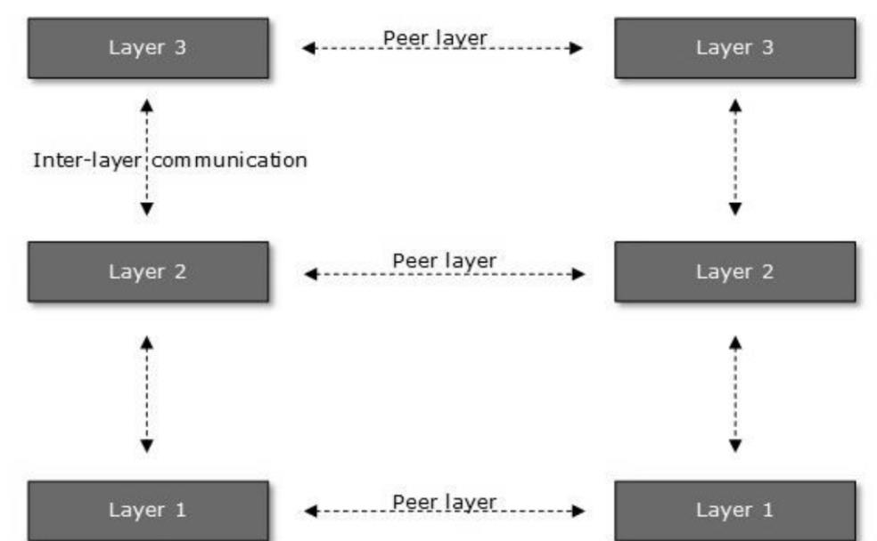
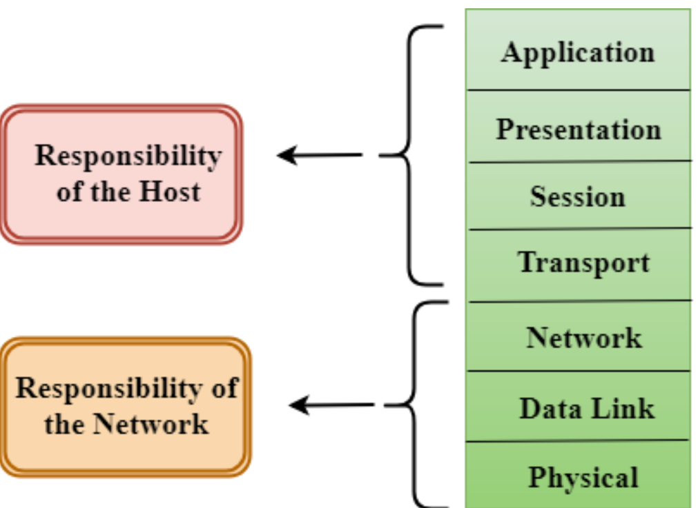
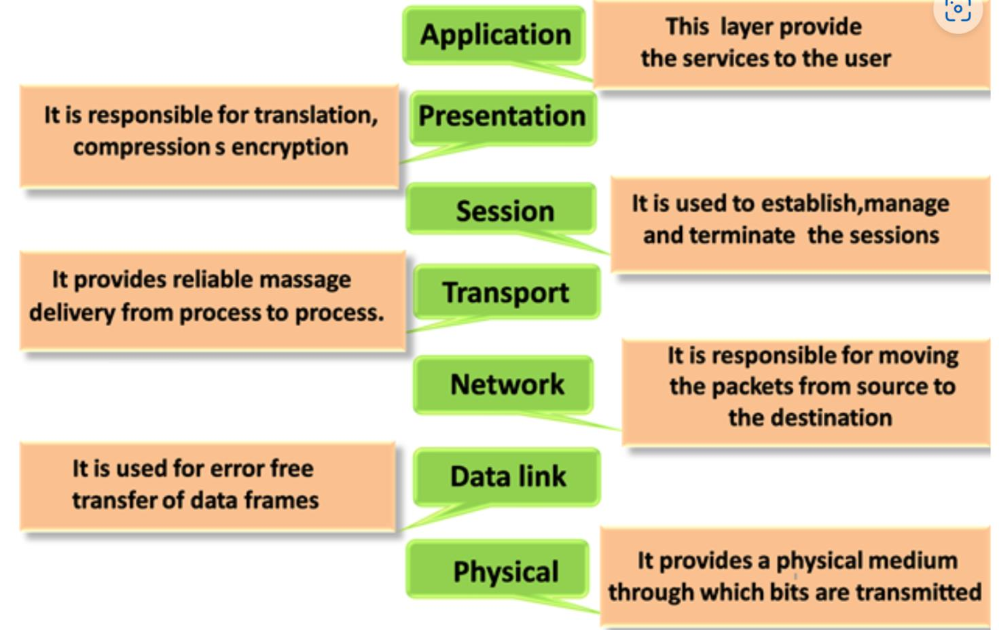
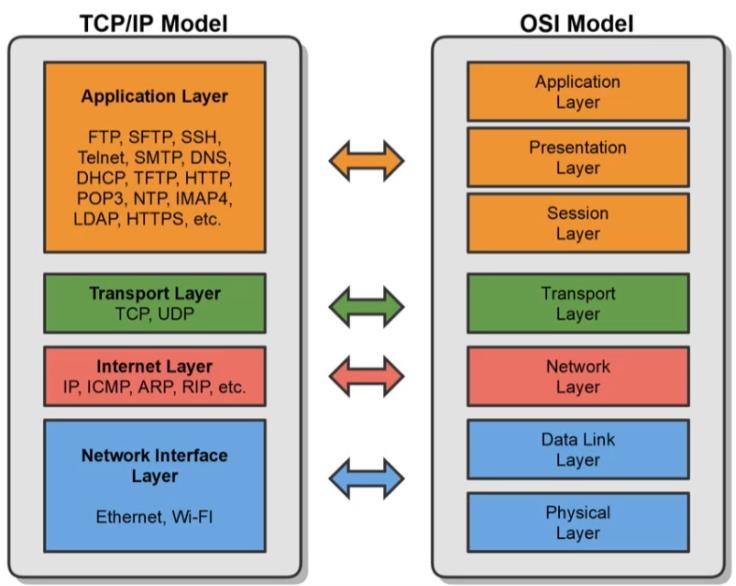
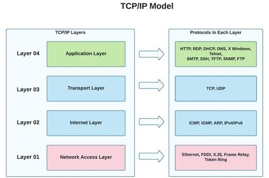
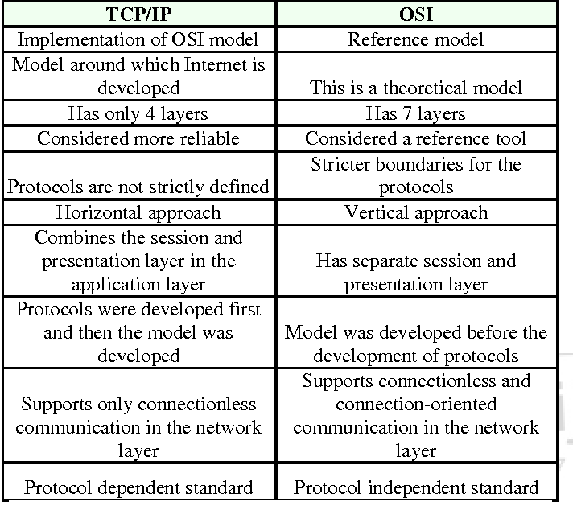

# Week 3: Network Architecture Model

# 1. Networking Model

* Networking model describes the architecture, components, and design used to establish communication between the source and destination devices.
* A simple transmission of data consists several steps at various layers of computer network. ISO has developed a layered approach divided in to several layers, and each layer is assigned a particular task.  Therefore, we can say that networking tasks depend upon the layers.

## 1.1 Layered Architecture

* The main purpose of having several layers in a computer network model is to divide a  process of sending and receiving data into smaller tasks.

  使用layer的目的：在接受和发送数据的过程中划分为更小的任务
* Each lower layer adds its services to the higher layer to provide a full set of services to manage communications and run the applications.

  每个较低的层将其服务添加到较高的层，以提供一整套服务来管理通信和运行应用程序
* It provides modularity and clear interfaces, i.e., provides interaction between subsystems.

  提供子系统间的交互
* It ensures the independence between layers by providing the services from lower to higher layer without defining how the services are implemented. Therefore, any modification in a layer will not affect the other layers.

  > ​​*这句话是对分层架构的解释。分层架构是一种软件设计模式，它将软件的功能划分到不同的层中，每一层都有自己的职责和功能。*
  >
  > *这句话指出，分层架构确保了不同层之间的独立性。它通过在不定义服务如何实现的情况下，从低层向高层提供服务来实现这一点。这意味着，在一层中进行修改时，不会影响其他层的工作。*
  >
  > *这种独立性是通过在每一层之间建立接口来实现的。这样，高层只需知道低层提供的服务，而不需要知道具体的实现细节。这样，高层就可以在不影响低层的情况下进行修改。在分层架构中，每一层都有自己的职责和功能，这样就可以使得软件具有更好的可维护性，更好的可扩展性。*
  >
  > ——ChatGPT
  >

* The number of layers, functions, contents of each layer will vary from network to network. However, the purpose of each layer is to provide the service from lower to a higher layer and hiding the details from the layers of how the services are implemented. There are three main components of a computer network model. Sender, receiver and carrier.

  每一层的目的是从低到高的层提供服务

  

## 1.2 basic elements of layered architecture

* **Service服务**: It is a set of actions that a layer provides to the higher layer.
* **Protocol协议**: It defines a set of rules that a layer uses to exchange the information with peer entity. These rules mainly concern about both the contents and order  of the messages used.
* **Interface**: It is a way through which the message is transferred from one layer to another layer.

## 1.3 Why do we require Layered architecture?

* **Divide-and-conquer approach**: This approach makes a design process in  such a way that the unmanageable tasks are divided into small and manageable tasks, thus reducing complexity of the design.
* 模块化**Modularity**: Layered architecture is more modular. Modularity provides the  independence of layers, which is easier to understand and implement.
* 易修改**Easy to modify**: It ensures the independence of layers so that  implementation in one layer can be changed without affecting other layers.
* 易测试**Easy to test**: Each layer of the layered architecture can be analyzed and  tested individually.

# 2.OSI Model

* OSI model was developed by the International Organization for Standardization (ISO) in 1984, and it is now considered as an architectural model for the inter-computer  communications.

  OSI被认为是计算机通信体系结构的模型
* OSI model describes how information from a software application in one computer  moves through a physical medium to the software application in another computer.

  OSI描述了信息如何从一台计算机中的软件通过物理介质 传递到另一台计算机中的软件应用程序
* OSI consists of seven layers, and each layer performs a particular network task
* Each layer is self-contained, so that task assigned to each layer can be performed  independently.

## 2.1Functions of the OSI Layers

There are the seven OSI layers. Each layer has different functions given below:

### 2.1.1物理层Layer1-Physical layer

Defines the physical and electrical medium for network communication:

* Sending and receiving bits(1 or 0)发送和接受bits
* Encoding Signal Types编码信号类型

  * Electricity, radio waves, light
* Networking Cabling, Jacks,Path Panels,etc.网络布线，插孔，路径面板

  * Copper or Fiber
* Physical Network Topology拓扑

  * Star, Mesh, Ring, etc.
* Ethernet IEEE 802.3 Standard
* Layer 1 Equipment

  * Hubs,Media Converters,Modems

It's responsible for the network hardware and physical topology.

### 2.1.2数据链路层 Data Link Layer

* The "Switching" layer
* Ensures that messages are delivered to the proper device on a LAN usiing hardware addresses.确保传递到正确设备

  * MAC(Media Access Control) address
  * Only concerned with the local delivery of frames on the same network
* Resonsible for packaging the data into frames for the physical layer.

  将数据打包到物理层的frames中
* Translates messages from the Network layer into bits for the Physical layer.

  将网络层的信息转化为bits

Data Link Layer has two sub-layers:

#### 2.1.2.1 逻辑链路控制层logical Link Control(LLC) Layer

* Error Control and Flow Control

  * Detect and correct corrupted data frames
  * Limits amount of data sent so devices aren't overwhelmed

#### 2.1.2.2 Media Access Control(MAC) Layer

* Physical Addressing (MAC Address)

  * 48-bit MAC Address burned on NIC.
* Logicval topology and media Access

  * Ethernet, Token Ring,etc.
  * CSMA/CD &CSMA/CA

## 2.1.3 网络层Network Layer

* The "Routing" Layer
* Provides logical addressing(IP Addressiing) and routing services.

  提供逻辑寻址及路由服务
* Places two IP address into a packet:

  * **Source Address** & **Destination IP Address**
* Internet Protocol(IP)

  * The primary network protocol used on the Internet,IPv4, IPv6 Logical Addresses

    使用主要的 网络协议 IPV4,IPV6 逻辑地址

Types of packet at Network Layer:

* Data Packets数据包

  * Routed Internet Protocol(IP) data packets

    * IPv4 & IPv6
* Route-Update Packets

  * Routing protocols designed to update

    neighboring routers with router infomation for path determination

    * RIP, OSPF,EIGRP,etc.

## 2.1.4 传输层Transport Layer

* Ensures data is delivered error-free and in sequence.
* Segments data and reassembles correctly.

  分割数据并且重新组合
* Can be connetion-oriented or connectionless.
* Considered the "post office" layer

  * TCP(Transmission Control Protocol)
  * UDP(User Datagram Protocol)
  * Converted in detail in the next section

Responsible for two data flow control measures:

* Buffering

  * Stores data in memory buffers until destination device is available.
* Windowing

  * Allows devices in session to determine the "window” size of data segments sent.

## 2.1.5会话层Session Layer

* Responsible for setting up, managing, and then tearing down sessions between network devices.

  建立和拆除网络设备间会话
* Ensures data from different application sessions are kept separate. 

  确保不同应用程序的数据是分开的
* Utilizes Application Program Interfaces (APIs)to communicate with TCP/IP protocols.

  利用APIs与TCP/IP协议通信
* Coordinates communication between systems.

Can provide three different methods of communication between devices:

* **Simplex**: One-way communication between two devices, like listening to a radio station.单向通信
* **Half Duplex**: Two-way communication between two devices, but only one device can communicate at a time.半双工
* **Full Duplex**: Two-way communication between two devices, where both sides can communicate at the same time.全双工

## 2.1.6表现层Presentaion Layer

* Ensures that data transferred from one system's Application Layer can be read by the Application Layer on another one.

* Provides character code conversion, data compression, and data encryption/decryption.

  提供字符码转换、数据压缩和加解密等功能

* Example: Google Chrome HTML converted to ASCII Format.

* Example Layer 6 File Formats:

  * Web Browser: HTML, XML, JavaScript
  * Graphics Files: JPEG, GIF, PNG
  * Audio/Video: MPEG, MP3
  * Encryption: TLS, SSL Text/Data: ASCII, EBCDIC

## 2.1.7应用层 Aplication Layer

* Where users interact with the computer.
* Acts as an interface between an application and end-user protocols.

  充当应用程序和最终用户协议之间的接口。
* Provides an interface to communicate with the network (Outlook, Chrome, etc.).

  提供一个与网络通信的接口
* Applications don't reside in the application layer but instead interfaces with applicationlayer protocols.
* Example Application Layer Protocols:

  * E-Mail: IMAP4, POP3, SMTP
  * Web Browsers: HTTP, HTTPS
  * Remote Access: SSH, Telnet

# 3. TCP/IP Model

* Transmission Control Protocol/ Internet Protocol
* Commonly called the Internet Protocol suite because it was designed for the Internet, but LANs use it too.

  互联网协议套件，为互联网设计，局域网也可使用
* First two protocols defined in the suite were: 

  * TCP & IP, hence TCP/IP
* Similar to the OSI model, but simpler:

  * OSI is conceptual

  * TCP/IP was implemented

## 3.1Network Access Layer

* A network layer is the lowest layer of the TCP/IP model.

  最底层
* A network layer is the combination of the Physical layer and Data Link layer defined  in the OSI reference model.

  是OSI模型中物理层和数据链路层的组合
* It defines how the data should be sent physically through the network.

  定义了如何通过网络物理地发送数据
* This layer is mainly responsible for the transmission of the data between two devices  on the same network.

  负责设备间的数据传输
* The functions carried out by this layer are encapsulating the IP datagram into frames  transmitted by the network and mapping of IP addresses into physical addresses.

  将IP数据报封装到由网络传输的帧中，并将IP地址映射到物理地址中
* The protocols used by this layer are ethernet, token ring, FDDI, X.25, frame relay.

## 3.2Internet Layer

* An internet layer is the second layer of the TCP/IP model
* An internet layer is also known as the network layer
* The main responsibility of the internet layer is to send the packets from any network, and they arrive at the destination irrespective of the route they take
* The following protocols used in this layer are: IP Protocol, ARP Protocol, ICMP Protocol
* IP Protocol: This is used in this layer, and the most significant part of the entire TCP/IP suite.  The responsibilities of the IP protocol include for IP addressing, host to host communication,  for fragmentation and reassembly, routing and for data encapsulation and formatting

  IP协议的职责包括IP地址、主机到主机之间的通信、碎片化和重组、路由以及数据封装和格式化
* Address Resolution Protocol (ARP Protocol): This is a network layer protocol which is  used to find the physical address from the IP address

  这是一个网络层协议，用于从IP地址中查找物理地址

  The two terms are mainly associated with the ARP Protocol:

  * > *ARP (地址解析协议) 是一种网络协议，用于在网络上将 IP 地址映射到硬件地址（例如MAC地址）。这是在局域网中通信时必须进行的操作。当一台计算机想要与另一台计算机通信时，它首先会使用ARP协议广播一个请求包，询问网络上的其他计算机是否知道目标IP地址对应的MAC地址。如果有计算机知道，它就会回复一个应答包，告诉请求者目标IP地址对应的MAC地址。*
    >
    > ——ChatGPT
    >

  * **ARP request**: When a sender wants to know the physical address of the device, it broadcasts the ARP request to the network.

    当发送方想知道设备的物理地址时，它会向网络广播ARP请求。
  * **ARP reply**: Every device attached to the network will accept the ARP request and process the request, but only recipient recognize the IP address and sends back its physical  address in the form of ARP reply. The recipient adds the physical address both to its cache  memory and to the datagram header

    接收方能识别IP地址，并以ARP应答的形式将其物理地址发回。接收方将物理地址添加到其高速缓存和数据报报头中

* **Internet Control Message Protocol:**

  * > *它是在网络层上运行的一种协议，用于在IP协议中传递控制消息。它主要用于网络管理和错误报告。 ICMP报文由源主机发送到目的主机，用于报告错误和状态信息。常见的ICMP消息类型有ping和traceroute。*
    >
    > ——ChatGPT
    >
  * This is a mechanism used by the hosts or routers to send notifications regarding datagram problems  back to the sender.用于将有关数据报问题的通知发送回发送方。
  * A datagram travels from router-to-router until it reaches its destination. If a router is unable to route the  data because of some unusual conditions such as disabled links, a device is on firewall or network  congestion, then the ICMP protocol is used to inform the sender that the datagram is undeliverable

    数据报从一个路由器到另一个路由器，直到到达目的地。如果路由器由于某些不寻常的情况(如链路禁用、设备在防火墙上或网络拥塞)而无法路由数据，则使用ICMP协议通知发送方数据报无法发送
  * An ICMP protocol mainly uses two terms:

    * ICMP Test: ICMP Test is used to test whether the destination is reachable or not.
    * ICMP Reply: ICMP Reply is used to check whether the destination device is responding or not.
  * The core responsibility of the ICMP protocol is to **report the problems**, not correct them. The  responsibility of the correction lies with the sender.
  * ICMP can send the messages only to the source, but not to the intermediate routers because the IP data gram carries the addresses of the source and destination but not of the router that it is passed to.

## 3.3Transport Layer

The transport layer is responsible for the reliability, flow control, and correction of data which is being sent  over the network. The two protocols used in the transport layer are User **Datagram Protocol and Transmi ssion Control Protocol**

* **User Datagram Protocol (UDP)**

  * It provides connectionless service and end-to-end delivery of transmission.
  * It is an unreliable protocol as it discovers the errors but doesn’t specify the error.
  * User Datagram Protocol discovers the error, and ICMP protocol reports the error to the sender that user datagram has been damaged
* **Transmission Control Protocol (TCP)**

  * It provides a full transport layer services to applications.
  * It creates a virtual circuit between the sender and receiver and it is active for the transmission period.
  * TCP is a reliable protocol as it detects the error and retransmits the damaged frames.

### 3.4Application Layer

* An application layer is the topmost layer in the TCP/IP model.
* It is responsible for handling high-level protocols, issues of representation.
* This layer allows the user to interact with the application.
* When one application layer protocol wants to communicate with another application layer, it forwards its data to the transport layer.
* There is an ambiguity occurs in the application layer. Every application cannot be placed inside the  application layer except those who interact with the communication system. For example: text editor can not be considered in application layer while web browser using HTTP protocol to interact with the  network where HTTP protocol is an application layer protocol.
* The main protocols used in the application layer are Hypertext transfer protocol (HTTP), Simple Network  Management Protocol (SNMP), Simple Mail Transfer Protocol (SMTP), Domain Name System (DNS),  Terminal Network (Telnet) and File Transfer Protocol (FTP)

# Difference between OSI Model and TCP/IP Model

