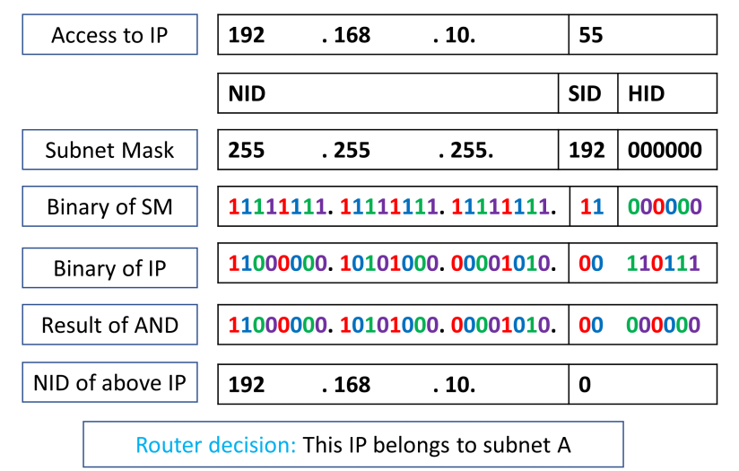
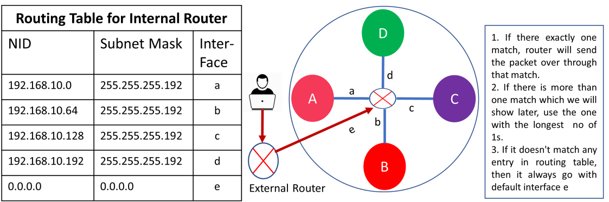
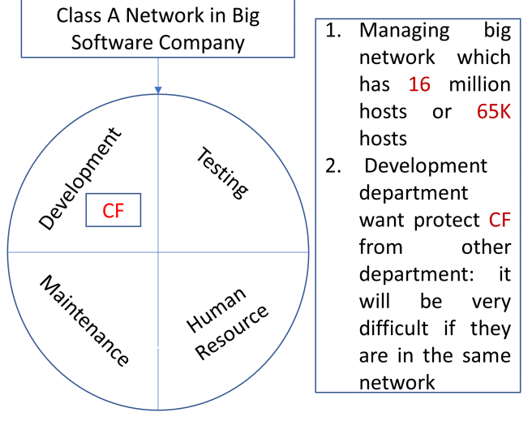
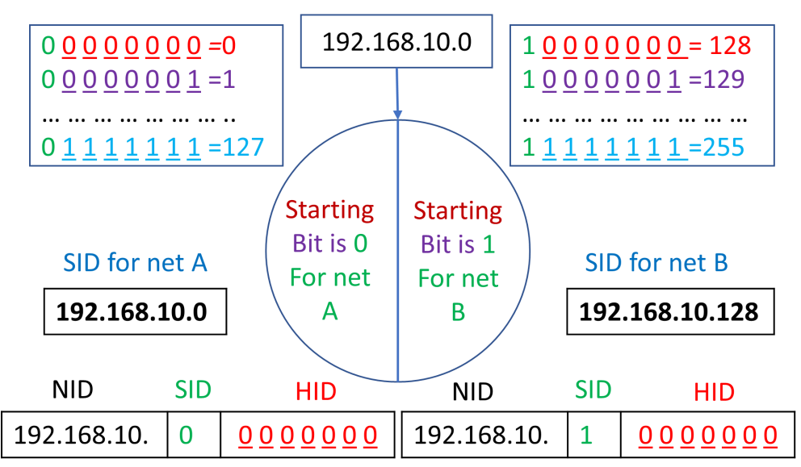
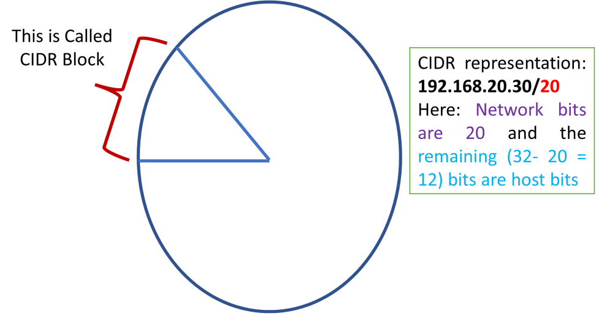
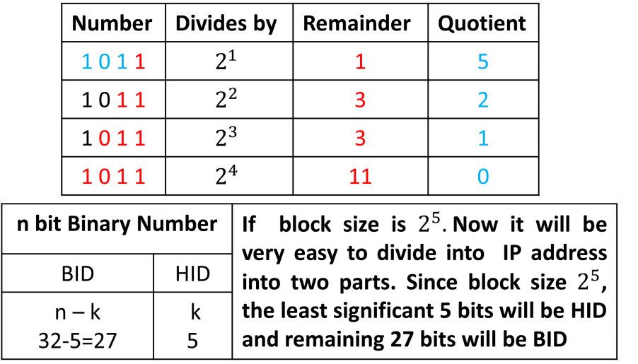
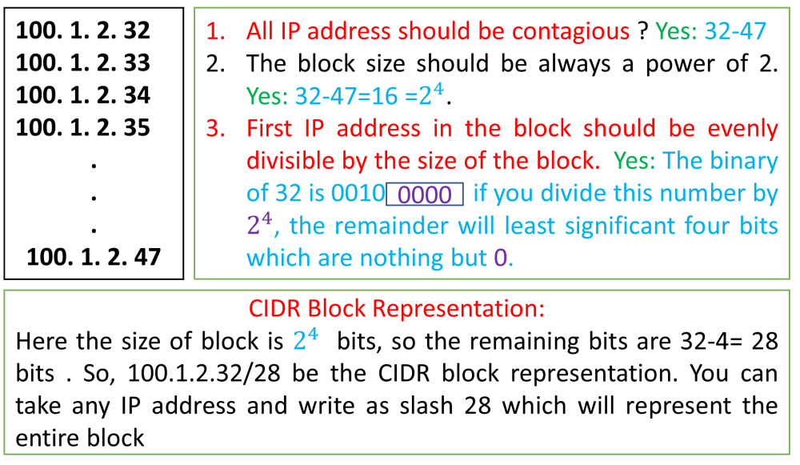
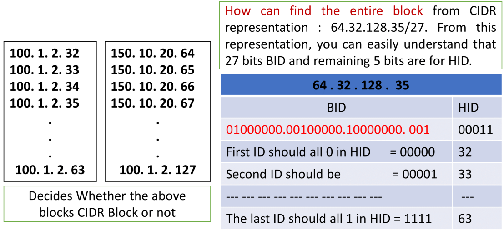

# Week4-Internet Protocol Addressing version 4 (IPv4)

# 1.IP Addressing

* An IP address is a 32-bit number.32位数字
* It uniquely identifies a host (computer or other device, such as a printer ) on a TCP/IP network唯一地标识TCP/IP网络上的主机
* IP addresses are normally expressed in dotted-decimal format, with four numbers separated by periods, such as 192.168.123.132. 

  For example, the dotted-decimal IP address 192.168.123.132 is (in binary notation) the 32-bit number 110000000101000111101110000100.
* These 8-bit sections are known as octets. The example IP address, then, becomes 11000000.10101000.01111011.10000100.
* An IP address has two parts which are network address and host address. If you take the  example 192.168.123.132 and divide it into these two parts, you get 192.168.123. Network .132  Host or 192.168.123.0 - network address. 0.0.0.132 - host address.

  IP地址为192.168.123.132

  网络地址为192.168.123.0

  主机地址为0.0.0.132

# 2.Subnet Mask

* Subnet mask is used by the TCP/IP protocol to determine whether a host is on the local subnet  or on a remote network.确定主机在本地子网还是在远程网络

  * ​`11000000.10101000.01111011.10000100`​ - IP address (192.168.123.132)
  * ​`11111111.11111111.11111111.00000000`​ - Subnet mask (255.255.255.0)
* The first 24 bits (the number of ones in the subnet mask) are identified as the network address.  The last 8 bits (the number of remaining zeros in the subnet mask) are identified as the host  address. 

  前24位（子网掩码中的1的个数）被标识为网络地址。最后8位（子网掩码中剩余零的数量）被标识为主机地址。

  It gives you the following addresses:

  ​`11000000.10101000.01111011.00000000`​ - Network address (192.168.123.0)

  ​`00000000.00000000.00000000.10000100`​ - Host address (000.000.000.132)

# 3.How Router finds the Network ID (NID) from Subnet Mask

* A host wants to communicate with a host with IP: 192.168.10.55 → Internal router get the IP  and subnet mask which are 192.168.10.55 and 255.255.255.192 respectively.

# 4.How Router Decides which Interface the arrived packet have to be transmitted

# 5.Network Classes

* IP addresses are divided into classes. The most common of them are classes A, B, and C. Classes D and E exist, but aren't used by end users.
* Each of the address classes has a different default subnet mask.
* **Class A networks** use a default subnet mask of 255.0.0.0 and have 0-127 as their first octet.  The address 10.52.36.11 is a class A address. Its first octet is 10, which is between 1 and 126.第一个数字为0-127
* **Class B networks** use a default subnet mask of 255.255.0.0 and have 128-191 as their first  octet. The address 172.16.52.63 is a class B address. Its first octet is 172, which is between  128 and 191, inclusive.第一个数字为128-191
* **Class C networks** use a default subnet mask of 255.255.255.0 and have 192-223 as their first  octet. The address 192.168.123.132 is a class C address. Its first octet is 192, which is  between 192 and 223, inclusive.第一个数字为192-223

# 6.Subnetting

* For Class A, it is really tough to maintain very big network for a network administrator
* We want to provide some security: Consider, in your office, there are four department within  the network: Developer Department, Testing Department, Maintenance Department, and HR  Department.
* We don’t want all the departments to access any common server: The development  department want to protect some confidential information from other department. It will be very difficult if they are all in the same network.
* If they are all in the same network: control the flow traffic using access control lists (ACLs) or  routing maps will be very difficult: as a result you cannot identify threats easily
* Subnetting is nothing but dividing a big network into many smaller networks
* Benefits: Easy to maintain, we could provide security to some particular network from the other networks.

# 7.How subnet works

* In class C network, there are 24 bits for network address and 8 bits for host address. With  this 8 bits, you can configure 2^8^ − 2 = 254 hosts
* If we want to divide that network into two parts: We fixed first bit si the subnet ID and the remaining 7 bits are host ID.
* This first bit is known as Subnet ID, in previous the network ID was 192.168.10 and now  subnet ID of network A is 192.168.10.0 and network is 192.168.10.128.

# 8.Classless Inter-Domain Routing (CIDR)

## 8.1 Why Classless IP Addressing

* In Classful classification, if your organization needs 257 IP address, you cannot stay in Class  C, you have to move to class B which has 2 16 IP addresses. Therefore, you have either take  254 IP address; otherwise, there will be waste of IP addresses if you go to Class B. This is the  main problem of Classful IP Addressing.

  CIDR是为了解决传统的classful IP地址分配方式带来的资源浪费问题而提出的。
* Till 1990, people use this classful IP addressing.
* To resolve this, researchers proposed classless IP addressing where IP address are not going  to divide into Class A, Class B, & Class C.
* In this case, you can buy the exact number of IP addresses need for your organization.

## 8.2 CIDR Block and Its Representation

* Now the question is if there are no class how can you identify the network bit and host bit?
* That is why CIDR is special notation: a.b.c.d/n where n indicates what is network bits from 32  bits IP address n的数量为二进制子网掩码中1的数量
* For example, if an IP address is 192.168.10.50/20, it means that from 32 bit IP address, 20 bits for NID and remaining 12 bits for HID.

## 8.3 Some Basic Idea About CIDR

Consider a Binary number 1011 if you divides this number by power of 2 What will happen?

## 8.4 Rules for forming CIDR Block

* All the IP addresses should be contiguous. If first IP address is .10, next IP address should be .11, .12, .13, and so on. That means, if you need 1000 IP addresses they should not assign 500 address from one block and another 500 IP addresses from another block.

  CIDR块中的IP地址要保持连续
* The block size should be always a power of 2. That means you should not asked for random IP addresses, e.g., you should not asked for 100 IP addresses. You should asked for 128.  Reason behind choosing power of 2 is shown in Figure 22

  CIDR块中的数量应该是二的幂
* First IP address in the block should be evenly divisible by the size of the block. When 32 bits number has to be divisible by 2n then the remainder has to be 0. Whenever you divide any  binary number by 2n , the remainder will be nothing but the least significant n bits. If the  number is evenly divisible, the remainder should be 0

  第一个IP地址应该被块数目整除

## 8.5Decides Whether the given Block is CIDR or not?

## 8.6Find the IPs of Entire Block from CIDR Representation

1. 将子网掩码的二进制位转换为整数, 子网掩码 /27 就对应为 27 个 1 和 5 个 0.
2.    IP地址: `01000000.00100000.10000000.00100011`​

    子网掩码: `11111111.11111111.11111111.11100000 ​`​

    网络地址: `01000000.00100000.10000000.00100000`​
3. 将网络地址的主机位全部设置为 0, 得到网络地址:`01000000.00100000.10000000.00100000`​，即`64.32.128.32`​
4. 将网络地址的主机位全部设置为 1, 得到最大地址:`01000000.00100000.10000000.00111111`​，即`64.32.128.63`​

## 8.7Looking at an IP address - CIDR

* When evaluating an IP address we need to know the CIDR number
* C.I.D.R = Classless Inter-Domain Routing
* The CIDR number is written after the IP address like this… 192.168.45.55 /24
* It corresponds to the numbers of bits used in the address

‍
