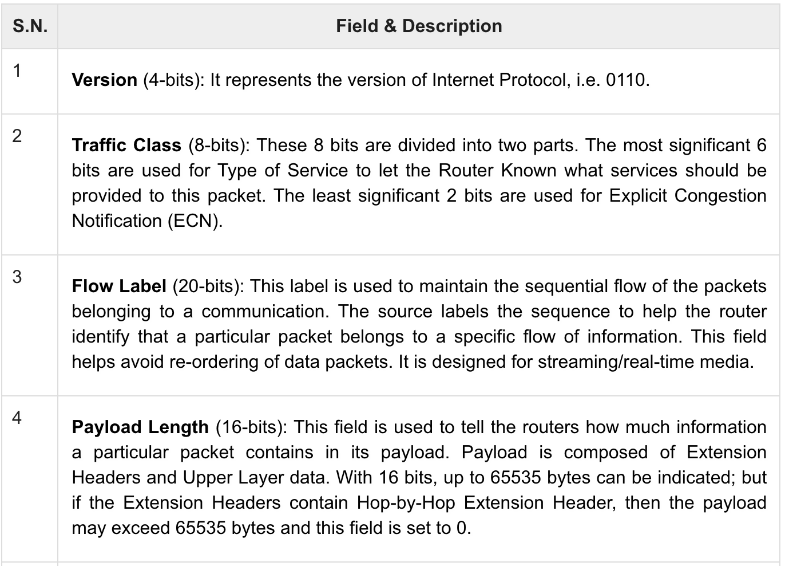

# Week 5-Internet Protocol Addressing version 6 (IPv6)

# 1.Overview – IPv6

* IPV6 is an addressing protocol designed to meet future requirements of Internet version 2
* IPV6 works on the Network Layer (layer 3)

  位于TCP/IP模型的第三层：网络层
* Addresses the short comings and limitations of IPV4

# 2.The needed for IPV6

* IPV4 has been around for decades when the internet was limited to only a few Universities and  the Military
* IPV4 is 32 bits long and has 4,294,967,296 (232) addresses - this was considered adequate in 1980 however…

  * The internet has grown exponentially
  * The address space for IPV4 has run out
  * IPV4 provides no built in security or QoS
  * IPV4 requires manual or some address configuration mechanism

## 2.1 Why not IPV5?

> *当开发人员开始设计IPv5时，他们决定采用一种称为ST（流量控制协议）的协议，用于语音和视频应用程序。但是，该协议并未广泛接受，最终没有普及。*

## 2.2 The state of the Internet today

* In 2012 some large internet companies put their servers on IPV6 while keeping others on IPV4
* They are currently using a dual stack mechanism(双栈机制) to implement IPV6 in parallel with IPV4

  > *使用双栈机制使IPv4和IPv6并行需要在计算机网络中实现双栈协议栈。这意味着网络设备具有两个独立的协议栈，分别处理IPv4和IPv6数据包。*
  >
  > *每个协议栈都有自己的地址空间和路由表，并且可以独立地接收和传输数据包。当网络中的主机或设备发送数据包时，它们可以选择使用IPv4或IPv6协议栈。接收方则通过该数据包的协议类型（IPv4或IPv6）将其分配给相应的协议栈。*
  >
  > *这种方法可以确保两个协议之间的兼容性，并使得IPv4和IPv6可以同时在同一个网络中使用。这对于升级网络以支持IPv6非常有利，因为可以在不影响IPv4通信的情况下实现IPv6支持。*
  >

# 3.IPv6 Features

## 3.1 IPV6 Features I

* IPV6 represents a complete redesign of the address space and is *not*  backwards compatible with IPV4

  不向“后”兼容，地址空间的完全重新设计
* Much larger address space - IPV6 boasts 3.4x10^38^ addresses
* Such a vastly huge address pool allows for 1564 addresses per every square meter on Earth

## 3.2 IPV6 Features II

* IPV6 header has been simplified by moving all unnecessary information and options to the end of the IPV6 header

  将不必要的信息移动到报头末尾
* This makes reading the information in the packet header faster
* The current header size is twice as big in IPV6 headers as opposed to IPV4

  IPv6报头的大小是IPv4的两倍

## 3.3 IPV6 Features III

* IPV6 features truly **unique IP addresses**
* Network Address Translation (NAT) is not required when going from a local area network (LAN) to the internet
* DHCP is also not required as users keep the same IP  address no matter where they go

## 3.4 IPV6 Features IV

* It was decided that IPV6 should have IPSEC security as a  standard - this is optional now but implementing it is quite simple

  > *IPsec (Internet Protocol Security)是一种为网络数据包提供安全性的协议。它通过加密数据、对数据进行数字签名以及对数据进行完整性检查，以确保数据的完整性、机密性和完整性在网络上传输。 IPsec可用于保护用户和网络资源的隐私和安全性，特别是在互联网上。它可以用于保护VPN（虚拟专用网）连接，以确保远程用户可以安全地访问内部网络。*
  >
* No more broadcast addresses - IPV6 no longer has any  broadcast support, using multicast to communicate to multiple hosts
* Another type of communication supported is Anycast  which allows for the closest server to be utilized

## 3.5 IPV6 Features V

* IPV6 was built with**​ mobility** and **mobile phones** in particular in mind
* Roaming in different geographic areas will be supported  and the user will still retain his original IP address

  支持在不同地理区域漫游，用户仍将保留其原始IP地址
* IPV6 also can take advantage of auto IP configuration and extension headers自动IP配置和扩展头

## 3.6 IPV6 Features VI

* QoS was incorporated into IPV6 while in IPV4 it was only  supported by devices that allowed for it

  QoS被整合到IPv6中
* In IPV6 traffic class and flow labels are used to tell the routers how to efficiently process the packet and route it

  > *Traffic Class是IPv6中的一个8位字段，用于分配优先级和QoS（Quality of Service）。*
  >
  > *Flow Labels是IPv6中的一个20位字段，用于标识特定的流量流，以便于提供特定的QoS服务。*
  >
  > *Traffic Class和Flow Labels有以下用途：*
  >
  > 1. *实现QoS：通过设置Traffic Class字段，网络设备可以对不同类型的流量进行分类，从而提供不同的服务质量。*
  > 2. *实现流量管理：通过使用Flow Labels字段，网络设备可以识别和管理特定的流量流，从而提高网络效率。*
  > 3. *提高网络安全：通过使用Traffic Class和Flow Labels字段，网络管理员可以更好地识别和防范恶意流量。*
  >
* IPV6 headers are extensible so more information can be add ed in the optional portion. The amount of additional  information that can be added is as large are the packet  itself (IPV4 was limited to 40 bytes)

  IPv6报头可扩展，可添加的额外信息的数量与数据包本身一样大

## 3.7 IPV6 Features VII

* IPv6 supports both stateful address configuration, such as  in the presence of a DHCP server, and stateless address configuration - address configuration in the absence of a DHCP server.

  IPv6既支持有状态地址配置，也支持无状态地址配置
* Note: Stateless Auto Configuration is an important feature o ffered by the IPv6 protocol. It allows the various devices atta ched to an IPv6 network to connect to the Internet using th e Stateless Auto Configuration without requiring any inter mediate IP support in the form of a Dynamic Host Configur ation Protocol (DHCP) server

  无状态地址自动配置是IPv6协议的重要特性，它允许连接到IPv6网络的各种设备使用无状态自动配置连接到Internet，而不需要任何动态主机配置协议(DHCP)服务器形式的中间IP支持

## 3.8 IPv6 Features VIII

* The Neighbor Discovery protocol manages the interaction of neighboring nodes (nodes on the same link)
* Neighbor Discovery replaces the broadcast-based Address Resolution Protocol (ARP), ICMPv4 Router Discovery, and IC MPv4 redirect messages with efficient multicast and  unicast Neighbor Discovery messages

# 4.Difference between IPv4 and IPv6

|IPv4|IPv6|
| :-----------------------------------------------------------------------------------------------: | :------------------------------------------------------------------------------------------------------------------: |
|Source and destination addresses are 32 bits (4 bytes) in length|Source and destination addresses are 128 bit s (16 bytes) in length|
|IPsec support is optional|IPsec support is required|
|No identification of packet flow for QoS hand ling by routers is present within the IPv4 header|Packet flow identification for QoS handling b y routers is included in the IPv6 header usin g the Flow Label field|
|Fragmentation is done by both routers and the sending host|Fragmentation is not done by routers, only the sending host|
|Header includes a checksum|Header does not include a checksum|
|Header includes options|All optional data is moved to IPv6 extension  headers|
|Address Resolution Protocol (ARP) uses broadcast ARP request frames to resolve an IP address|ARP request frames are replaced with multi cast Neighbor solicitation messages|

# 5.IPv6 Addressing Modes

* IPv6 offers several types of modes by which a single host  can be addressed

‍

## 5.1Unicast

the host is equipped with a unique IP address

它允许一台计算机通过网络向另一台计算机发送单独的数据包。这种方式通常用于点对点通信，并且数据包只能被接收方接收，不会被其他任何计算机接收。

## 5.2Multicast

The IPv6 multicast mode is the same as IPv4. The packet destined to multiple hosts is sent on a special multicast address

它允许一台计算机通过网络向另一台计算机发送单独的数据包。这种方式通常用于点对点通信，并且数据包只能被接收方接收，不会被其他任何计算机接收。

## 5.3Anycast

New to IPv6 multiple hosts are assigned the same Anycast IP address. When it wishes to communicate it sends a Unicast message - the server with the lowest routing cost gets the message

> 它允许一台计算机向网络中的任意一个或多个计算机发送数据包。与多播不同，任播并不限制只能发送给特定的一组计算机，而是可以向网络中的任意计算机发送数据包。这种方式通常用于分布式系统或者实现特定功能，如路由选择和路径选择。

# Hexadecimal Numbering System

An IPv6 address is made up  of 128 bits divided into eight 16-bits blocks – each block is  converted into a 4 digit Hex number separated by colon symbols

# Hex Addressing

0010000000000001 0000000000000000 0011001000111000 1101111111100001 0000000001100011 0000 000000000000 0000000000000000 1111111011111011

Each block is then converted into Hexadecimal and separated by a ":"  symbol

2001:0000:3238:DFE1:**0063**:0000:0000:FEFB

Rule 1: Discard leading zeroes

2001:0000:3238:DFE1:**63**:0000:0000:FEFB

# Hex Addressing II

2001:0000:3238:DFE1:63:**0000:0000**:FEFB  
Rule 2: If two or more blocks contain consecutive zeroes, omit them all and replace with double colon sign ::, such as 6th and 7th block

2001**:0000:**3238:DFE1:63::FEFB  
Consecutive blocks of zeroes can ONLY be replaced once by :: so if there are still blocks of zeroes in the address, they can be shrunk down to a single zero, such as the 2nd block

2001**:0:**3238:DFE1:63::FEFB

# Interface ID

* IPv6 has three different types of Unicast address scheme - the  second half of the address is used for interface ID
* The MAC address of a system is composed of 48 bits and this  can be used to generate a unique IPv6 number

  

# Addressing types

* IPv6 Utilizes 3 different types of addressing for communication

  * Global Unicast
  * Link Local
  * Unique Local

## Global Unicast Address全球范围寻址

* This address type is equivalent to IPv4‟s public address
* Global Unicast addresses in IPv6 are globally identifiable and uniquely addressable

  IPv6中的全球单播地址是全球可识别和唯一寻址的

  

## Link Local Address链路本地寻址

* An auto-configured address is known as the Link-local address.
* These are used for communication among IPv6 hosts on a link (broadcast segment) only.

  链路上IPv6主机之间的通信
* These addresses are NOT routable and so these are never forwarded beyond the local network
* This address starts with FE80 and the first 16 bits of link-local address is always set to 111 1 1110 1000 0000 (FE80). The next 48 bits are set to zero

  ​​

## Unique Local Address

ULA是私有的，仅在特定的地址范围内可用，不能在全球范围内使用。

* This type of IPv6 address is globally unique but it should be used in local communication
* The second half of this address is the Interface ID - the “from”MAC address

​​

Prefix is always set to 111 110. L bit is set to 1 if the address is locally assigned So far the meaning of the L bit set to 0 is undefined. Unique local IPv6 address starts with "FD"

# Scope of IPv6 Addresses

# Special Addresses

* Like IPv4, IPv6 has some special address spaces that are reserved

  ​​

  In IPv4 0.0.0.0 with net mask 0.0.0.0 represents the default route and this same  concept is also applied to IPv6 0:0:0:0:0:0:0:0 this is compressed to ::/0

* Loopback addresses in IPv4 this is 127.0.0.1 but in IPv6 this is 0:0:0:0:0:0:0:1/128

# Special Addresses - Multicast

These rules for IPv6 mirror the same rules for IPv4

# Special Addresses - Reserved Multicast Ad dresses for Routers

* These addresses help routers and hosts to speak to available  routers and hosts on a segment without being configured with an IPv6 addresses
* Hosts use EUI-64 based auto-configuration to self-configure an  IPv6 address and then speak to available hosts/routers on the  segment by means of these addresses

# IPv6 Headers

* IPv6 headers are 2x the size of IPv4 headers

* The fixed header (above) has all the information that is critic al for routing the packet including a QoS field

# IPv6 Fixed Head

# Extension Headers

* In IPv6 the fixed header contains only the information  necessary for routing and prioritization
* Extension headers are optional and is pointed to by the Extension headers"Next-Header" field

  

* These headers are processed by First and subsequent destinations
* Are also processed by the Final destination
* They are arranged one after the other in a linked list  manner

  

# Communication in IPv4

* If a host wants to communicate with another host in IPv4 both need an IP address acquired by DHCP or manual configuration
* A host must know the IP address of the other host
* Communication on a link is done via embedded hardware MAC addresses, this is discovered via an ARP broadcast or  response

# Communication in IPv6

* In IPv6 there are *no* broadcast mechanisms and DHCP is optional
* Hosts can configure their own IP addresses
* ARP has been replaced by ICMPv6 Neighbor Discovery Protocol

# Neighbor Discovery Protocol

* A host in an IPv6 network is capable of auto-configuring its elf with a unique link-local address
* As soon as a host gets an IPv6 address it joins a number of  multi-cast groups
* All communications for that segment take place on those multicast address only
* After configuring all IPv6 hosts either manually, by DHCP or by auto-configuration
* The Host sends a Neighbor Solicitation message out to FF0 2::1/16 multicast address for all its IPv6 addresses to find out  if anyone else has that address
* DAD (Duplicate Address Detection) When the host does  not get notified from any other host in answer to the above, it assumes no duplicate address exists
* After assigning the addresses to its interfaces and making them up and running, the host once again sends out a Neighbor Advertisement message telling all other hosts on the segment, that it has assigned those IPv6 addresses to its interfaces

# Host action after configuration

* Router solicitation - this is a multicast packet and is used to discover routers on its segment
* Router advertisement (RA) - when a router receives a router  solicitation it responds back to the host directly
* Redirect - if a router receives a solicitation message but it  knows that another gateway would serve the host better,  this is sent - this contains the „next hop‟ address for the  other more efficient router

# IPv6 Subnetting

* IPv6 addresses use 128 bits to represent an address - these  include bits for subnetting

  

* The second half is for hosts only therefore the number of hosts is not reduced if we subnet the network
* 16 bits of subnet space is equivalent to IPv4‟s Class B Network  therefore using them you can generate 65,635 separate subnets

# Transitioning from IPv4 to IPv6

* IPv6 is not backwards compatible which means a site is  either an IPv6 site or it is not
* Other technologies have therefore been implemented to  allow for a slow and smooth transition
* 

* A router can be installed with both IPv4 and IPv6 addresses  configured on its interfaces
* The router shown above is called a dual stack router
* 

* Tunneling technologies are also used to route IPv4 traffic  through a IPv6 network
* This is essentially a packet inside a packet

# NAT Protocol Translation

* In the diagram above a IPv4 host sends information to the  IPv6 internet (which doesn‟t understand IPv4)
* The NAT protocol translator NAT-PT modifies the packets so as to make them compatible with IPv6

# Mobility

* Under IPv4 a host requires an IP address that is compatible with a local link
* As soon as the user moves outside the range of that link all communication stops
* In order to re-establish a connection, a new link must be  found and a new IP address loaned out to the host
* Under IPv6 the host can roam to different links without  losing any connections and using the same IP address

  * The entities involved with this are;

    * Mobile device - this is the host (like your cellphone) that  needs IPv6 mobility
    * Home link-this is configured with the same subnet  prefix and this is where your phone gets its home  address
    * Home address - this is the permanent address of the  phone

# Entities continued

* Home agent - this it the router that acts as a register for  Mobile devices - this is connected to Home link
* Foreign link - any other link that is not Mobile devices home -link
* Care-of Address - this is the new address acquired by your phone once it attaches to a foreign link

# Mobility Operation

* After leaving the home link, the device attaches to a foreign  link and receives a care-of address
* Home agent binds the home address with the care of  address, creating a tunnel between both

# Routing Protocols in IPv6

* Distance Vector Routing Protocol - a router that advertises  its connected routes and learns new routes from it‟s neighbors
* Cost is calculated by number of hops
* The router will rely on its neighbors for best path selection
* Link-State Routing Protocols - this protocol acknowledges the state of the link and advertises same to it‟s neighbors
* The router itself calculates the best path to all available links
* Shortest Path First is utilized
* Interior Routing Protocol - these are used within an organization (inside a business or school)

  * RIP and OSPF are algorithms to find shortest path with interior routing protocols
* Exterior Routing Protocol - this is routing on the internet backbone and exists to establish routes between organizations

  * BGP is an algorithm that is used to find the shortest path with exterior routing protocols

# Routing Protocols Types - IPv6

* RIPng - This stands for Routing Information Protocol Next  Generation

  * This is an interior routing protocol and uses distance vectors to make routing  decisions
* OSPFv3 - Open Shortest Path First v3

  * This is an interior routing protocol that uses Link state and Djikrasta‟s SPF algorithm  to calculate the best path
* BGPv4 - Border Gateway Protocol - this is an exterior  protocol, uses distance vectors and is open source

# Other Protocols Changed

* IPv6 has required that other protocols in common use be modified  and changed in order to support it some of these are…
* ICMPv6 - Internet Control Message Protocol

  * used for diagnostic and error messages
  * NDP replaces ARP
* DHCPv6

  * Optional use as hosts on IPv6 do not require IP addresses
  * DNS can be discovered via ICMPv6 neighbor discovery
  * Still DHCP can provide this information if desired

# Summary

* Since 1982 IPv4 has been in use but is now rapidly running out of  addresses
* Less than 1% of the internet runs IPv6 at present
* In 2011 - IPv6 was tested over the wider internet and was officially  launched on June 06, 2012
* China is the world leader in IPv6 implementation with a 5 year  plan in place to transition to IPv6 fully
