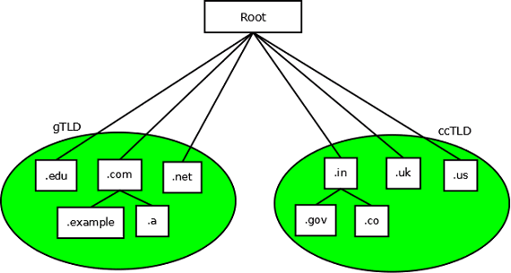
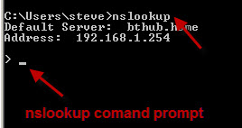
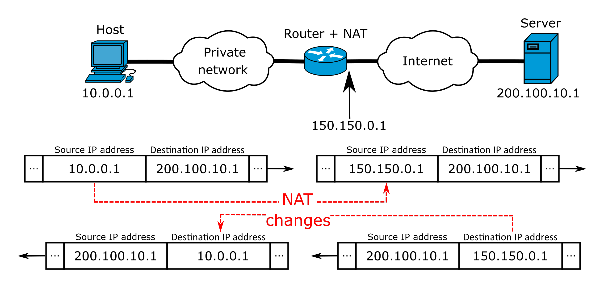

# Week7-Domain Name System

# Concept DNS

* DNS stands for Domain Name System
* DNS resolves an IP address to a host name

  DNS将IP地址解析为主机名

* DNS is basically a large database which resides on many  computers that contain the names and IP addresses of  various hosts/domains

# What is DNS?

* The domain name system (DNS) is a naming database in which internet  domain names are located and translated into Internet Protocol (IP)  addresses.

  域名被定位并转换为internet协议(IP)地址。

* The domain name system maps the name people use to locate a website  to the IP address that a computer uses to locate that website.

  将人们用来定位网站的名称映射到计算机用来定位该网站的IP地址。

# How DNS Works

* Your web browser doesn‟t understand “www.baidu.com"
* And so when you type this into a url, it must be translated into a number

# Practical Example How DNS works

* Step 1: If you are using Windows please open up a command prompt or If you're using a MAC please open a terminal window
* Step 2: Try to *ping www.baidu.com*(you should get 220.181.38.251)
* Step 3: Now copy and paste that number on your web browser

# Structure of DNS

* DNS uses a hierarchal tree based name structure.
* At the top of the tree is the “root” which is a “.” followed by the TLD ( Top Level Domain)
* The top level is controlled by the USA
* Top Level Domains are further divided into 2 categories

  * Generic TLD
  * Country Code TLD

> DNS 的结构包括以下几个部分：
>
> 1. 域名空间：它是 DNS 的根目录，用于存储所有可用域名的信息。
> 2. 域：它是一个逻辑组织单元，表示域名空间的一个子树，可以存储许多资源记录。
> 3. 资源记录：它是 DNS 数据的基本单元，存储域名与其他信息（例如 IP 地址）之间的映射关系。
> 4. 解析器：它是 DNS 系统的客户端，用于询问 DNS 服务器以解析域名。
> 5. DNS 服务器：它是负责接收客户端请求并返回相应数据的服务器。
>
> DNS 的结构是分层的，与分布式数据库相似，其中每一层部分都负责存储和维护特定数据，以便支持整个系统的功能。
>
> DNS 的这种分层结构有助于维护数据的整洁和完整，同时也使得 DNS 系统更容易扩展和维护。
>
> TLD 指的是顶级域名（Top-Level Domain）。它是指一级域名的顶级域名编号，比如 .com、.org、.net、.gov 等。
>
> TLD 可以用来标识特定类型的网站，例如 .com 通常表示商业网站，.org 通常表示非营利组织，.net 通常表示互联网相关的组织，而 .gov 则用于表示政府机构。
>
> 不同的 TLD 有不同的注册和维护要求，因此它们可以用来识别网站的类型和实际管理者。此外，不同的国家和地区也有自己的国家代码顶级域名（ccTLD），例如 .cn 表示中国、.uk 表示英国等。

# Structure of the DNS Tree

# Authority

* The Authority for the root domain and gTLD lies with the  Internet Corporation for Assigned Numbers and Names  (ICANN).
* ccTLD's are delegated to individual county governments  for administration purposes
* Each level in the hierarchy may delegate the authoritative control to the next lower level.
* There is a DNS server running in every level of the hierarchy and the responsibility of running the DNS server lies with the Authority at that level
* Example - when the root domain gets a DNS query for www.baidu.com the root will delegate responsibility for resolving this to its lower level  ".com", which in turn will delegate to"baidu".
* Finally the DNS server in the "baidu" will respond with the IP address of  the hostname "www"

# The Zone File

* A zone file is simply a portion of a domain
* Example: baidu.com may contain all the information  for a translate.baidu.com, shopping.baidu.com, and  music.baidu.com
* However usually baidu.com delegates the  responsibility for translate.baidu.com to translate  rather than keep all the information itself

> 区域文件（Zone file）是 DNS 系统（Domain Name System）中存储特定域名信息的文件。它包含了与特定域名相关的 IP 地址，指向特定网站的记录等信息。
>
> 每个域名都有一个对应的区域文件，存储在与该域名相关的 DNS 服务器上。当某个网站的域名被请求时，DNS 服务器会读取该网站的区域文件，以确定该域名对应的 IP 地址。
>
> 区域文件是保证 Internet 上的域名解析过程的正确性和可靠性的重要组成部分。它确保了所有请求的域名都能够被正确解析，并被正确的指向到目标网站。

# Resource Records

> 资源记录（resource record）是 DNS 中最基本的数据结构，它表示域名系统的信息。
>
> 资源记录包含有关某个域名的信息，例如该域名的 IP 地址、邮件服务器（MX）记录、名称服务器（NS）记录等。这些资源记录存储在区域数据库中，并被 DNS 服务器读取以解析用户请求的域名。
>
> 每个资源记录都包含以下几个字段：
>
> * 名称：要解析的域名
> * 类型：资源记录的类型（例如 A、MX、NS 等）
> * TTL：资源记录在 DNS 缓存中存在的时间
> * 资源数据：关于该域名的具体信息，例如 IP 地址、邮件服务器等。

* A DNS zone database is made up of a collection of resource records
* Each resource record specifies information about a particular object  and the DNS server uses these records to answer queries for hosts in its zone
* The records are called “A” records which map a host name to an IP  address and reverse-lookup pointer (PTR)records which map an IP  address to a host name

# Resource – ‘NS’ Records

* An NS record or “name server” record maps  a domain name to a list of DNS servers that  are authoritative for that domain
* Delegations depend on NS records

# Resource – ‘MX’ Records

* An MX record or “mail exchange” record maps a domain  name to a list of mail exchange servers for that domain
* When you send an email to 123@qq.com the mail will be  routed to the Mail server as specified in the MX record

# DNS Queries

* A DNS query would be something like “what is the IP

  address of www.taobao.com
* A DNS server may receive such a query for any domain,  which it has no direct information about
* Depending on what information the DNS server has, it  will respond differently!
* A DNS server may service three types of queries

  * Recursive Query
  * Iterative Query
  * Inverse Query

## DNS Recursive Queries

In a recursive query the following are the steps taken by the DNS server for translate.baidu.com

* Host sends query 'what is the IP address of translate.baidu.com' to locally configured DNS server.
* DNS server looks up translate.baidu.com in local tables – not found
* DNS sends query to a root-server for the IP of translate.baidu.com
* The root-server replies with a referral to the TLD servers for .com
* The DNS server sends query 'what is the IP address translate.baidu.com' to one of the .com TLD servers
* The TLD server replies with a referral to the name servers for baidu.com
* The DNS server sends query 'what is the IP address translate.baidu.com' to name server for baidu.com.
* Zone file defines A record which shows ‘translate” IP address is x.x.x.x.
* DNS returns the A record for 'translate'.

## DNS Iterative Queries

* In a iterative query, if the DNS server doesn't  know the answer it will refer to another DNS server for a response
* So the client which initiated the query will  then try to contact the new DNS server for a  response
* In a Inverse query, an IP address will be provided and a host name will be asked
* This query can take the same path as the Recursive and Iterative query possibilities
* The only difference is that it is providing an IP address and requesting a hostname

# nslookup as a Querying Tool

nslookup is a tool for direct querying of IP a ddress or host domains.

Benefits of nslookup as a Querying Tool:

* Useful for finding the IP address of a host
* Finding the domain name of an IP address
* Finding the mail servers for a domain

# Network Address Translation (NAT)

* In order to go to the internet a client computer needs a public IP address
* However having your own public IP address costs money  and moreover there are not enough of them to go around
* Therefore a technology called Network Address Translation  was implemented

## What is Network Address Translation (NAT)

* Network address translation (NAT) is a method of mapping an  IP address space into another by modifying network address  information in the IP header of packets while they are in  transit across a traffic routing device.
* Network Address Translation 'translates' a private LAN  address such as 192.168.1.37 into a public IP address like  47.65.34.123

  

## Usefulness of Network Address Translation (NAT)

* There are several situations where we need address  translation such as when a network does not have  sufficient public IP addresses but still wants to connect all its clients to the internet or two networks that have the same IP addresses want to merge together
* Security is also a consideration. Many organizations  don‟t want to expose their internal IP structure to  the outside world

## Types of NAT

* There are 3 types of NAT

  * Static NAT
  * Dynamic NAT
  * PAT
* These three types define how inside local IP addresses will be mapped with the inside global IP address

### Static NAT

* Static NAT manually map each inside local IP address with an inside global IP address
* This type uses "one to one" mapping and requires exactly the same number of IP addresses on both sides of the router
* Static NAT only works if are few clients or several public IP addresses to use

### Dynamic NAT

* Dynamic NAT creates a pool of inside global IP addresses  and allows the NAT device to map inside local IP addresses with the available global IP addresses from the pool automatically

### PAT NAT

* PAT – NAT maps a single inside global IP address with multiple local IP addresses using the source port address
* This is also known as PAT (Port Address Translation) or NAT over-load

## Benefit of NAT

* The Network is built with private IP addresses and needs to be connected to the internet. To do this we need to use public IP addresses.
* In this situation we use a NAT device which will map a private IP address with a public IP address
* Two networks are using *the same* IP address scheme and want to merge. In this situation the NAT device is used to prevent IP conflicts
* We want to connect multiple computers with the internet through a single public IP address. In this situation NAT is used to map the multiple IP addresses with a single IP  address through port numbers
* NAT hides the internal IP structure of an organization.
* NAT allows device to connect with any network without changing IP addresses.
* NAT allows the connection of multiple computers with the internet through a single public IP address.

## Working Principles of NAT

## Disadvantages of NAT

* NAT adds additional delays in the network
* Several applications are not compatible with NAT
* End to end IP traceability will not work with NAT
* NAT hides the actual end device
