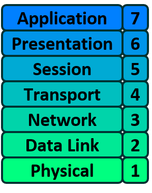
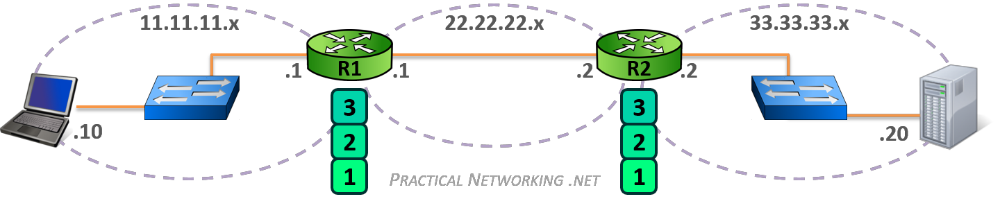
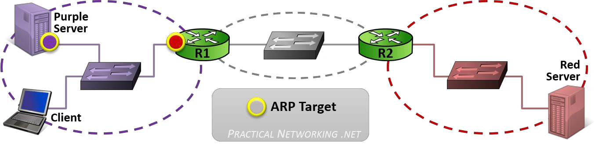
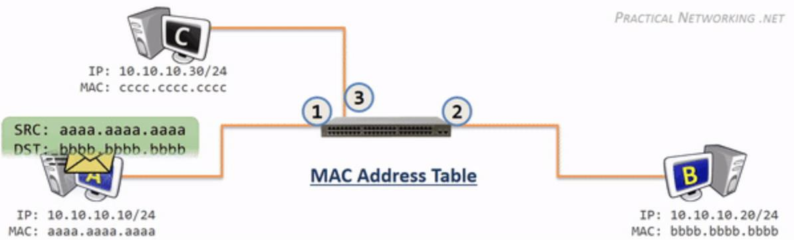
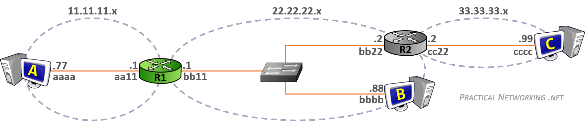
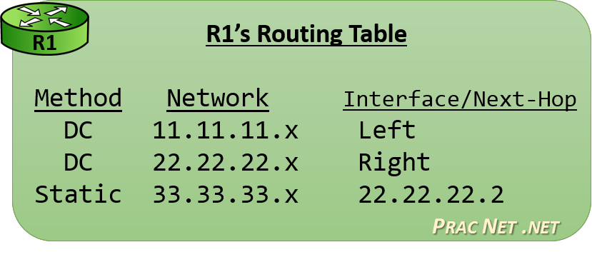
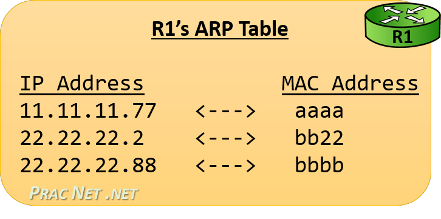
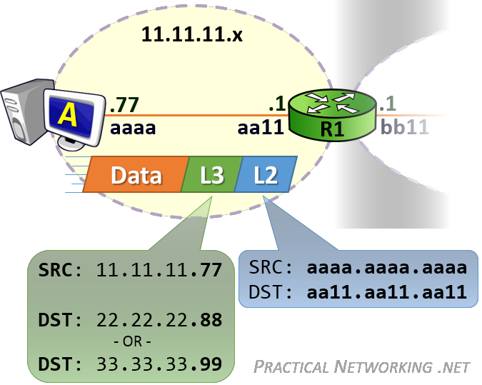
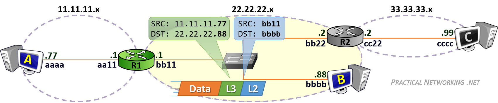
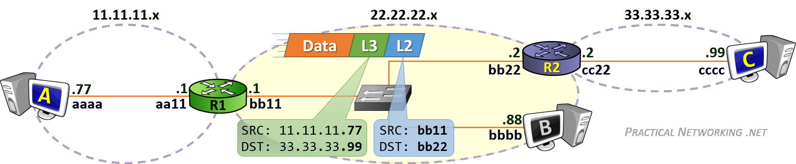

# Week8-packet traveling and ARP

# Review of OSI

* Layer 1 - cables and wifi
* Layer 2 - datalink
* Layer 3 - Network
* Layer 4 – Transport
* Layer 5 – Layer 7-Session, presentation and application,Upper layer

​​

# What is a Packet of Data?

> 数据包是计算机网络中传输数据的基本单位。它是一个带有源 IP 地址、目标 IP 地址、协议类型和数据内容的数据单元。
>
> 当计算机向另一台计算机发送数据时，数据被分割成许多小数据包，然后通过网络进行传输。每个数据包都是独立的，可以在路径上的不同路由器之间的不同顺序中到达目标地址。
>
> 数据包的优势在于它可以通过网络的不同路径，以避免网络故障或拥堵，并可以在到达目标地址后重新组合成原始数据。

* It is a piece of a data file that is about 1500 bytes long
* Each packet gets a wrapper that includes the senders address, destination address, and the packets place in the entire message

  当一个数据包在网络中传输时，会在外面加一层包装，这层包装中包含了发送这个数据包的主机的地址、目标地址和数据包在整个消息中的位置。这样的信息对于路由器或交换机来说非常重要，他们需要这些信息来判断数据包应该往哪里转发。
* Missing packets can be requested again if any go  missing or are dropped provided the transmission  control protocol (TCP) is being used and not UDP.

  > TCP (Transmission Control Protocol) 和 UDP (User Datagram Protocol) 是两种不同的网络协议，用于在计算机之间传输数据。
  >
  > * TCP 是面向连接的协议，在传输数据之前会建立一个可靠的连接。它确保所有的数据都可以正确地从一个计算机到达另一个计算机，并且是按照预定顺序到达的。
  > * UDP 是无连接的协议，不需要在传输数据之前建立连接。它通常用于发送少量的数据，例如多媒体数据，并希望在不考虑数据丢失的情况下尽快传输数据。
  >
  > 总的来说，TCP 用于可靠的长期数据传输，而 UDP 用于快速但不一定完整的数据传输。应用程序可以根据需要使用适当的协议来传输数据。
  >

# Encapsulation and Decapsulation

> Encapsulation（封装） 和 Decapsulation（解封装） 是指数据在传输过程中所经历的封装和解封装的过程。
>
> Encapsulation 是将数据从一层封装到另一层的过程，在这个过程中，数据在被传输到网络上之前被封装在数据包中。
>
> Decapsulation 则是数据从一层解封装到另一层的过程，在这个过程中，数据包在到达目的地后被解封装。
>
> 这两个过程在数据在网络中传输过程中是不断重复的，每当数据在网络上移动一层时，都要经历一次封装和解封装的过程。

* This refers to how data is moved through the layers from top to bottom
* As the data is moved from layer to layer each layer adds the information it  requires to accomplish its goal BEFORE it is converted to 1's and 0's
* Layer 4 will add a TCP header which would include a Source and Destination port.

  第4层将添加一个TCP报头，其中包括一个源端口和目的端口。
* Layer 3 will add an IP header which would include a Source and Destination IP address.

  第3层将添加一个IP头，其中包括一个源IP地址和目的IP地址
* Layer 2 would add an Ethernet header which would include a Source and  Destination MAC address.

  第2层将添加一个以太网报头，其中包括源MAC地址和目标MAC地址。
* > 在物理层，数据包被编码为比特流并在网络中通过电信号或光信号传输。
  >
  > 在数据链路层，数据包被加入帧头，以确保数据能够通过网络的物理层。
  >
  > 在网络层，数据包被加入数据报头，以标识该数据包的源和目的地。
  >
  > 在传输层，数据包被加入传输段头，以确保该数据包能够通过网络层并正确地到达目的地。
  >
  > 在会话层，数据包被分成若干段，以管理对话过程。
  >
  > 在表示层，数据包被转换成应用程序可以使用的格式。
  >
  > 在应用层，数据包被应用程序使用，它可能被解释为电子邮件、文件下载请求或其他形式的数据。
  >

# Switch

* A switch is a network device whose primary purpose is to facilitate communication within a network
* Switches operate at Layer 2 of the OSI model and only look into each  datagram header up to the Layer 2 header

  OSI模型的第2层工作，只查看第2层报头之前的每个数据报报头
* The layer 2 header contains information that allows for hop to hop delivery, such as the source and destination MAC address
* Working Principles of switches:

  * Switches operate by maintaining what is called a MAC address table. This maps MAC addresses of devices plugged into each switch port

    交换机通过维护所谓的MAC地址表来运行。这个表映射了每个交换机端口插入的设备的MAC地址。
  * The MAC table is populated by looking at the Source MAC address field of any received frames

    MAC表的信息是通过查看接收到的帧的源MAC地址字段来填充的。
  * In order to forward the frame, the Switch will lookup the Destination  MAC address in their MAC table to determine what port to use

    为了转发帧，交换机将在其MAC表中查询目的地MAC地址，以确定使用的端口。
  * If a switch encounters a frame for which it doesn’t know the location of the destination it simply duplicates and floods the frame out of  each switch port (except the receiving port)

    如果交换机遇到一个关于它不知道目的地位置的帧，它会复制并将该帧从每个交换机端口（除接收端口）进行泛洪。

    > 如果一个交换机遇到一个目标位置未知的帧，则交换机会广播该帧到网络上的所有端口，直到该帧的目标位置被发现为止。此过程被称为学习，交换机可以通过该过程学习网络中主机的位置，并使用该信息来快速转发数据帧。
    >
  * > 交换机是网络通信中的一种网络设备，它主要负责在物理层面上接收、转发和过滤数据包。交换机在数据传输过程中工作如下：
    >
    > 1. 接收数据包：交换机在接收到数据包后，会先分析数据包的目标地址和源地址。
    > 2. 确定目标地址：交换机会通过内部的 MAC 地址表（也称为 ARP 表）来确定数据包的目标地址，以便确定数据包应该发往哪一台设备。
    > 3. 存储在缓存中：交换机会将接收到的数据包存储在缓存中，以便确保数据的完整性。
    > 4. 转发数据包：交换机会将数据包转发到目标地址的设备上，以便进行数据的传输。
    > 5. 过滤数据包：交换机还可以根据设定的规则进行数据包的过滤，以便确保网络安全。
    > 6. 交换机与路由器的不同之处在于，路由器在网络层面上转发数据包，而交换机则在物理层面上转发数据包。
    >

# Router

* A router is a network device whose purpose is to facilitate communication BETWEEN networks
* Each interface on a router creates a network boundary
* Routers operate at layer 3 of the OSI model and examine the source and destination IP address

* In this image R1 and R2 create 3 separate networks
* The only way for client .10 to speak to server .20 is to forward the packet to R1
* Routers accomplish this by maintaining a routing table - this table contains paths to all the networks a router knows how to reach
* Each entry contains an interface or IP of the next router in the path to  the target
* If a router receives a packet to a route it doesn’t know about that  packet is discarded
* > 1. 路由器的工作原理是根据数据包的目的地址以及网络路径选择表，决定数据包的下一个跳转目的地。
  > 2. 当路由器接收到一个数据包时，它会检查数据包的目的地址，并根据网络路径选择表选择最优的路径。
  > 3. 路径选择表是路由器预先配置的表，用于指示该数据包应该流向哪个网络。路由器还可以动态更新其网络路径选择表，以确保网络总是使用最优路径。
  > 4. 路由器对数据包的加工仅限于检查数据包的目的地址，并通过网络路径选择表确定数据包的下一个跳转目的地。
  >

# Address Resolution Protocol (ARP)

> ARP (Address Resolution Protocol)是一种协议，它在IP网络中用于将一个IP地址映射到它的物理地址（例如MAC地址）。
>
> 当一台主机想要发送数据包到网络上的另一台主机时，它需要知道目标主机的物理地址，因此它会广播一个ARP请求，询问网络上的所有主机是否拥有某个IP地址。
>
> 如果找到了目标主机，它就会回复一个ARP响应，其中包含目标主机的物理地址。请求主机可以使用此信息来发送数据包。 ARP协议构成了在IP网络上进行通信的基础。

* Address Resolution Protocol bridges the gap  between IP addresses and MAC addresses
* Typically when two hosts are communicating they  already know each other’s IP address usually via  DNS but their MAC address is NOT known
* The hosts will use ARP to discover the appropriate  MAC address
* Address Resolution Protocol (ARP) is a  communication protocol used to find the MAC (Media  Access Control) address of a device from its IP  address.

  地址解析协议(ARP)是一种通信协议，用于从设备的IP地址中找到设备的MAC(媒体访问控制)地址。
* This protocol is used when a device wants to  communicate with another device on a Local Area  Network or Ethernet.

* In the image above if a client in the purple network needs to speak to the purple server it will know the  Server's IP address and determine it exists in the local network - when a client is in the same network it will  issue an ARP request for the host's MAC address.
* If the purple client wants to speak to the Red Server, it will know the Red server's IP address and further it will know that the Red server exists in a foreign network. As such the packet will be sent to the nearest router - the default gateway
* To sum up when a client is speaking to a host in the  same network - it will ARP for the MAC addy of the host

  当客户端要与同一网络中的主机通信时，ARP (Address Resolution Protocol) 的作用是帮助客户端确定目标主机的物理地址（即 MAC 地址）。客户端发送一个ARP请求报文，其中包含目标主机的 IP 地址，网络中的其他主机收到这个请求后，如果这个 IP 地址与他们自身的 IP 地址相同，则回复一个 ARP 响应报文，告诉客户端它的 MAC 地址。客户端通过接收到的 ARP 响应报文，就可以得到目标主机的 MAC 地址，从而实现与目标主机的通信。

* When a client is speaking to a host in a different  network it will ARP for the MAC of the default gateway
* Packet delivery is ALWAYS the job of layer 2 and layer  2's primary goal is getting a packet from hop to hop
* Conversely layer 3 is concerned with end to end delivery is unable to put a packet on a wire and send it to another host's NIC (network interface card)
* ARP's role is to help the client create the proper L2  header

# Host to Host Communication

* As there are no routers/switches communication is  happening on the same network - therefore both hosts have been manually configured with IP’s on the same network
* At the start both hosts ARP tables are empty
* Host A makes some data for Host B and knows B’s IP
* Even though IPs are known packet delivery is the JOB  OF LAYER 2 therefore a layer 2 header must be created

  即使已知了IP地址，但是数据包的传递仍然是网络层2（第2层）的任务。因此，必须创建第2层的首部，以在网络中正确传递数据包。第2层的首部包含有关数据包的重要信息，例如源地址和目的地址的MAC地址。
* Host A must initiate an ARP request in order to get  the required information from B

  主机A必须发起ARP请求，以获取来自B的所需信息。
* This question is sent to EVERYONE because Host A  doesn't know that Host B exists yet!
* Also note that Host A sends it’s own MAC along with  the request
* Host B receives the request and learns about Host A  - this information is added to Host B's ARP table
* Host B can now directly respond to Host A
* the ARP response will include the information Host A  requested: the IP address 10.10.10.20 is being  served with the MAC address bbbb.bbbb.bbbb

  主机A必须发起ARP请求，以获取来自B的所需信息。
* Host A will now use this to populate its own ARP  table

# What is MAC Address?

* MAC address is the physical address, which uniquely  identifies each device on a given network.
* To make communication between two networked  devices, we need two addresses: IP address and  MAC address.
* It is assigned to the NIC (Network Interface card) of each device that can be connected to the internet
* These numbers are embedded during the manufacturing  process and are designed not to be modified
* They are traditionally 12 digit (6 bytes or 48 bits)  hexadecimal numbers
* These are usually written in one of three formats

  * MM:MM:MM:SS:SS:SS
  * MM-MM-MM-SS-SS-SS
  * MMM.MMM.SSS.SSS
* The “MM” is a prefix associated with the adapter  manufacturer and each is assigned a prefix by the  IEEE

# Host to Host Via Switch

* A switch does 4 things: Learning, Flooding,  Forwarding and Filtering

  > 1. 学习：交换机记录与连接的设备的MAC地址的对应关系。
  > 2. 淹没：当交换机不知道数据包的目标位置时，它将数据包广播到所有端口。
  > 3. 转发：交换机将已知目标地址的数据包转发到正确的端口。
  > 4. 过滤：交换机可以根据特定规则阻止特定数据包的传输。例如，它可以阻止未经授权的访问。
  >
* MACs are used to make decisions about forwarding
* A switch will automatically try to learn about its  network and update its MAC Address table
* Anytime it receives something it makes a note of the  senders MAC address

## Switch Flooding

> 交换机淹没是一种交换机在不知道数据包目标位置时广播数据包到所有端口的行为。当交换机接收到一个数据包，但是它不知道该数据包的目标位置在哪里时，它会把该数据包复制到所有的端口上。这样，目标主机就可以收到数据包，并回复该数据包的来源。这种技术确保了数据包可以通过网络传输到其目的地，即使交换机不知道其位置

* A switch will at some point receive a frame destined to a MAC address it doesn't know
* When this happens the only thing a switch can do is  duplicate the frame and send it out on all ports
* This ensures that if the intended exists and IF it is  connected to the switch it will definitely receive the frame
* When the intended device receives the frame it will send a  response to the switch thus allowing the switch to create a  new entry in its MAC table

## Switch Forwarding

> 当交换机接收到数据包时，它通过检查目标地址来确定该数据包的目的地，并将其发送到正确的端口上，以便它可以通过网络到达其目的地。交换机在收到数据包后检查其目的地址，并使用它自己的MAC地址表（在淹没过程中收集的）来决定该数据包应该发送到哪个端口。因此，交换机转发可以确保数据包快速，高效地在网络中传输，避免了网络拥堵。

* There are three methods the switch can forward  frames

  * Store and forward - The switch copies the entire  frame (header and data) into a memory buffer and  checks for errors - this is slow but allows for  prioritizing

    交换机将完整的数据帧存储到内存中，然后对其进行整体性检查（如CRC校验），再转发到目标端。
  * Cut-Through - the switch stores nothing and  inspects only the bare minimum to read the MAC

    交换机从源端接收到数据帧时，立即读取目标端的MAC地址并进行转发。这种方法更快，但如果数据帧有错误，则无法检测到。
  * Fragment free - this is a blend and it only inspects  the first 64 bytes of the frame - "good enough"

    这是一种折中的方法，它将数据帧的前64字节存储到内存中，以检测帧的整体性。如果数据帧有错误，则不进行转发。否则，将整个帧立即转发。

## Switch Filtering

* This function mainly exists to make sure the switch  never forwards out a frame from the same port it  came from originally
* This happens mostly when a flood is necessary
* Sometimes a host will send a frame with a  destination MAC that is the same as itself - this frame  is discarded as these are usually malicious and this is  a type of attack

## Common Switch Path

* Host A has something to send to Host B
* The contents do not matter so long as it has a Layer 2  header with a source and destination MAC address
* When Host A sends the frame to the switch the switch  learns the MAC address of Host A
* The switch doesn't have a entry for Host B so floods  the network
* When it receives a response the switch updates its  information

## Flooding vs Broadcasting

* When the switch receives a broadcast frame, it sends  it out to everyone connected to it
* In flooding the switch sends the frame to all because  it doesn’t know how to reach the destination.
* In broadcasting the host that created the frame itself  addressed the frame to everyone.

# Host to Host via Router

* Routers communicate via Layer 3 and create network  boundaries.
* In order to forward packets between networks, routers must maintain an ARP table.
* The Routing table is the routers map of all existing networks.

# Router Learning

There are 2 ways routers learn about other networks.  These ways are as follows;

1. Directly Connected Route
2. Static Route

* Directly Connected Route: This is a direct  connection such that when a router is configured with  an IP address the router will know about the network  it is directly connected too
* Static Route: This is manually configured by an  administrator and is the next “hop” i.e. another router

* Remember that if a router receives a packet for a  network that is not contained on its routing table then  it is simply dropped!

# Populating an ARP Table

* The Address Resolution Protocol (ARP) is the bridge between Layer 3 and Layer 2
* When provided with an IP address the ARP resolves the  correlating MAC address
* Devices employ an ARP table (ARP cache) to resolve mappings
* A router will use its ROUTING TABLE to determine the next IP address which should receive a packet

# Router Operations

# Routes Pointing to an Interface

# Routes Pointing to a next hop

‍
