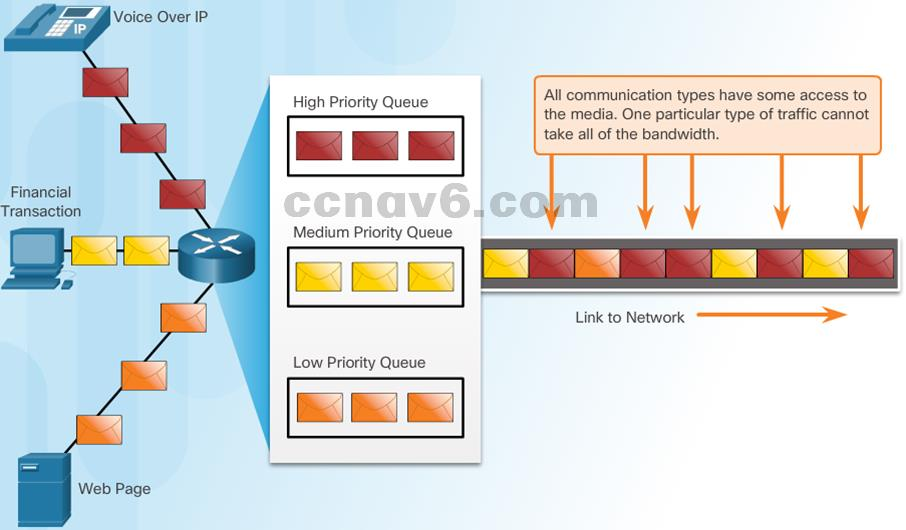
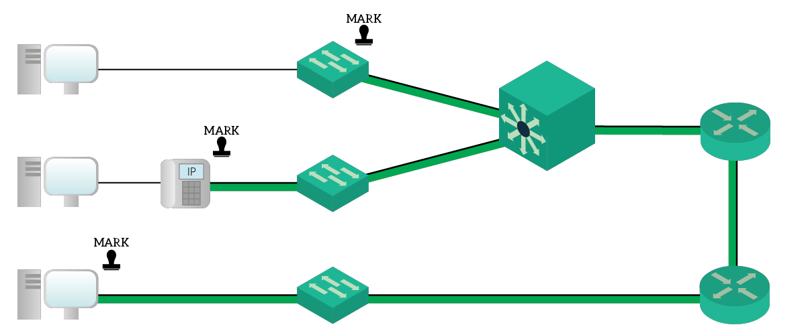

# Week9-QoS

# Concept of QoS

> QoS（Quality of Service）指的是通信质量，是指网络系统对多种不同的数据传输通信的优先级的管理。它的目的是在网络中安排带宽，以便更加关键的通信（如实时语音或视频通信）获得更多的带宽，而普通的数据通信（如邮件或文件下载）则获得相对较少的带宽。这样做是为了确保重要的通信具有较高的效率和可靠性。

* Does the packet being received contain data from a user downloading the latest songs from Spotify or is it important speech traffic from a VoIP business phone call?
* The network switch or router really doesn't care

* Quality of service (QoS) is the use of mechanisms or technologies that work on a network to control traffic and ensure the performance of critical applications  with limited network capacity
* The primary purpose of networks is to deliver information
* QoS allows you to prioritize network traffic

# Types of Network Traffic

Network demands are different and there are many  types of traffic. There are 3 common network traffic  which are as follows;

* Voice Traffic
* Video Traffic
* Data Traffic

## Voice Traffic

*  Voice - also called VoIP is very sensitive to delays;  dropped packets are NOT re-transmitted
* Voice must receive higher network priority than other types of traffic

  更高的网络优先级
* Voice can tolerate a certain amount of disruption
* Uses User Datagram Protocol (UDP) ports and  provides a smooth stream of packets.

## Video Traffic

* Compared to voice, video is less resilient to loss and has a higher volume of data per packet
* Video can tolerate a certain amount of disruption without noticeable affects
* Uses User Datagram Protocol (UDP) ports
* Bursty by nature

## Data Traffic

* Certain Data applications have no tolerance for data  loss, such as email and web pages
* Uses TCP to ensure any lost packets are retransmitted
* Data traffic is relatively insensitive to delays as compared to voice and video
* Smooth and bursty

# Characteristics of Network Traffic

There are four characteristics that affect network  traffic which are:

* Bandwidth
* Delay
* Jitter
* Loss

## Bandwidth

* The measurement of the amount of data that can be  sent through a cable or via WiFi is called bandwidth.
* You may have seen measurements like 100Mbps or  1000Mbps (megabit and gigabit ethernet)
* If you are using 20Mbps on a 100Mbps line you will  enjoy a perfect experience
* If you are trying to send more data than the link can  handle, such as 120Mbps against a 100Mbps line  information will be lost.

  > 如果发送的数据速率超过了当前网络链接的数据传输速率，那么网络就不能处理全部的数据，一部分数据将会丢失。例如，如果你试图在100 Mbps的网络线路上发送120 Mbps的数据，这些数据将不能全部被处理，一部分将会丢失。
  >

  ‍

## Delay

* Delay is the time it takes for a packet to get from the  source to a destination - this is called one way delay.
* The time it takes to get from a source to the  destination and back is called round trip delay
* Types of Delay:

  * Processing delay - this is the time it takes for a  device to perform all tasks to forward the packet such as;

    * Do a lookup on the routing table
    * Check its ARP table
    * Check its access-lists

    在网络设备上等待处理的数据包的时间。
  * Queuing delay - the amount of time a packet is  waiting in a queue. If there is congestion the packet  will have to wait in the queue before it is transmitted.

    在网络设备上等待处理的数据包的时间。
  * Serialization delay - the time it takes to send all bits  of a frame to the physical interface for transmission.

    在传输数据时，将数据转化为适合通信媒介的数据流（如从位到字节）所需要的时间。
  * Propagation delay - the time it takes for bits to cross  a physical medium - example the time it takes to go  through 10 km fibre link vs a satellite link.

## Jitter

* Jitter is the variation of a one-way delay in a stream of packets
* Example - a VoIP phone call is organized into packets and some packets are delayed. The delay between packet 1 and 2 is 20ms and between 2 and 3 is 40ms. This must be organized to preserve the quality

## Loss

* This is the absolute loss of data packets. If you send  100 and only 95 make it that is a 5% packet loss.
* The chance of packet loss increases with congestion

# Packet Marking

> Packet Marking 是一种网络技术，用于对数据包进行标记以识别其优先级和特殊要求。这种标记通常在数据包的 IP 头部或数据链路层被添加。Packet Marking 用于实现 Quality of Service (QoS)，即提高网络通信的质量。

* The basic concept is quite simple: during congestion  we take different actions on different packets.
* If we don't configure the router to assign and respond  to the priority level of the packets, the router will not  know what to do with the packets.
* In order to do this we mark each packet with a priority  level
* In this example, different packets are marked with a  priority level

  P10 is the highest while P1 is the lowest in this  example.

  

# IP Packet Headers

> IP 包头是指构成 IP 协议的数据包的头部信息。IP 包头包含了关于该数据包的各种信息，如源 IP 地址、目的 IP 地址、TTL（生存时间）、协议版本、标识符等。
>
> IP 包头是数据包在网络中传输的重要部分，因为它用于指导数据包如何通过网络到达目的地。每个 IP 包都是通过网络设备，如路由器或交换机，按照其 IP 包头中的信息来转发的。
>
> 在一些情况下，IP 包头也可用于识别数据包的类型和优先级，从而实现 Quality of Service（QoS）。例如，可以通过识别数据包的协议类型，将语音通话或视频流标记为优先数据包，以确保数据包能够及时到达目的地。

* The header of the IP packet contains 8 bits that we  use to specify the priority - this is called the ToS - Type of Service field
* There are 2 sub-fields to this:

  * DSCP - Differentiated Serviced Code Point - the  true priority of the packet.
  * ECN - Explicit Congestion Notification - used to  tell other devices have congestion.

    > DSCP (Differentiated Services Code Point) 和 ECN (Explicit Congestion Notification) 是 IP 数据包头的两个字段，用于控制网络流量。
    >
    > DSCP 是一种分层的网络服务优先级机制，其将数据包分成多个不同的类别，根据不同的类别，网络可以对数据包实施不同的处理，从而实现不同的服务水平。
    >
    > ECN 是一种技术，用于在网络拥塞时通知发送方，并使发送方可以减少流量，避免数据丢失。在网络拥塞时，网络设备会在 IP 数据包头中的 ECN 字段中标记报文，表示该数据包在网络中遇到了拥塞。通知发送方减少发送速率。发送方收到 ECN 标记后，可以自动调整发送速率，以保证更好的网络效率。
    >

## DSCP Values

* What are these priorities exactly?
* Priority levels use 26 bits - 64 combinations.
* We group priorities in 3 macro categories

  1. Best Effort
  2. Assured Forwarding
  3. Expedited Forwarding

### Best Effect

* This is the DEFAULT BEHAVIOR of the router and  basically means QoS
* Routers will drop these packets as soon as a  congestion happens and these will be forwarded only if resources are available
* > *Best Effort 的意思是，网络将尽最大努力，为数据流提供服务，但并不保证数据流的到达时间、丢包率和其他性能指标。在网络拥塞时，Best Effort 数据流可能会受到影响，导致延迟增加、丢包增多等。*
  >

### Assured Forwarding (AF)

* This setting will deliver the packet unless traffic  exceeds a specific rate
* The more the traffic exceeds that rate the more the  router will be inclined to drop it during congestion
* In order to mark these packets as AF we put AFXY where X is the class number and Y is the intra-class  number. The value of Y ranges from 1 to 3 - (1 low  drop probability - 3 high drop probability)
* > *Assured Forwarding (AF) 是 DSCP（Differentiated Services Code Point）的一种特殊的分类和排队方法。AF 可以通过在 IP 包头中设置特定的 DSCP 值，为特定的数据流分配优先级和带宽资源。*
  >
  > *AF 可以在网络拥塞时保证数据流的服务质量，避免丢包和延迟。在网络设备上，AF 可以通过排队策略和丢弃策略等机制，对不同 DSCP 值的数据包进行分类和排队，以保证数据流的可靠传输。*
  >
  > *AF 还可以根据数据流的类型和需求，设置不同的优先级等级，提供更加细致的 QoS 控制。例如，可以将视频流和语音流设置为高优先级，将文件下载和邮件等设置为低优先级*
  >

### Expedited Forwarding(EF)

* This is the best class
* Low delay, low jitter
* Often used for VoIP and Video because it allows the  fastest transfer rates
* > *Expedited Forwarding (EF) 是一种服务类型，主要用于优先处理需要低延迟、低丢包率和高带宽的数据流。EF 服务通常用于语音、视频等实时应用，以保证其较好的用户体验。*
  >
  > *EF 服务是通过标记数据流的数据包，并对其进行特殊处理实现的。在网络中，EF 数据流的数据包会被优先排队、快速转发，并有较高的带宽分配。同时，EF 数据流的数据包不会因为网络拥塞而受到丢包影响，从而保证了其低延迟和低丢包率的性能。*
  >

# Device Trust

* Every packet comes with a QoS marking but the value of the field is not automatic
* Various devices that generate the traffic on the  network send it with a QoS mark BUT also  intermediary devices can change these values

A switch, an IP phone and a PC

* The devices that can apply QoS and change DSCP  values are part of a trust device domain
* In the graphic, all the cables with a green underlay represent the trust domain

  所有带绿色衬底的电缆代表信任域
* In a good network we don't want to trust the user's  PC, we want to trust IP phones and access switches
* Cisco switches and routers can set the DSCP value of packet or override it

# QoS Action- The Interface Buffer

> *接口缓冲区，也称为接口队列，是一种用于网络接口数据传输的缓存区。它位于接口和数据链路层之间，负责暂存数据并维护数据的发送顺序。当数据到达接口时，它会先存储在缓冲区中，等待传输。这对于防止网络拥塞、提高网络效率等都有重要作用。*
>
> *接口缓冲区的大小取决于接口的带宽和网络性能等因素，一般而言，它的大小越大，则缓存的数据量就越多，从而可以防止接口拥塞。但如果缓冲区太大，也可能导致数据丢失和重复发送等问题。因此，在实际应用中，接口缓冲区的大小要经过合理的调整。*

* Each interface has two buffers: incoming and outgoing.

  每个接口有两个缓冲区:传入和传出。
* These are portions of memory where stored packets are waiting to be processed and that are waiting for the link availability to be sent out.
* If either the incoming or outgoing buffer is full, it means  the router is going faster than the link can handle.
* We can only apply QoS rules on the outgoing buffer.

# Policing and Shaping

> *Policing and Shaping是网络流量管理的技术。*
>
> *Policing是用于限制*​***输入流量***​*超过网络设备承受能力的技术，并将超额的数据丢弃。这是通过在输入端对流量速率进行限制来实现的。*
>
> *Shaping是一种通过限制*​***输出流量***​*速率来规划设备所发送的数据的技术。它的目的是减少网络中的丢包，从而提高网络的效率。*
>
> *两种技术都是通过在网络设备上配置策略来实现的，以确保网络的正常运行和优化性能。*

* QoS has two major approaches for QoS:  Policing and Shaping. Both act on the traffic exceeding the limit
* Policing is the simplest approach - traffic exceeding the limit will be **dropped**
* Shaping leverages queuing buffers and changes the shape of the graph
* Excess traffic is stored in the buffer and parceled out over time
* When deciding which to use you must consider the kind of traffic being sent
* VOIP is delay-sensitive and a delayed packet here is just as unusable as a dropped one
* Whereas application downloads can significantly benefit from shaping

# QoS Tips

* QoS is a bit-bucket mechanism
* Imagine a water bucket slowly getting filled - QoS activates only when water starts flowing over the edge of the bucket
* QoS supports bursts, meaning it can bend its rules if  traffic exceeding the limit quickly returns back into the  allowed range
* These rules can be tuned, effectively customizing the approach to burst traffic
* Voice requires latency of no more than 150ms and  Jitter should be no more than 30ms with total packet  loss no more than 1%
* Voice traffic requires at least 30kb/s bandwidth
* Video requires latency of no more than 400ms and Jitter should be no more than 50ms and packet loss should be no more than 1%
* Video traffic requires at least 384kb/s bandwidth

# QoS Summary

* QoS starts only during congestion periods
* QoS takes its decisions based on a field in the IP packet (DSCP), this indicates priority

  QoS根据IP数据包(DSCP)中的字段进行决策，这表示优先级
* Switches and Routers should set DSCP value based on network needs
* We group DSCP values in 3 major branches:  Expedited Forwarding (EF) for **low delay**, Assured  Forwarding (AF) for **delayable but critical traffic**, and Best Effort for **no QoS**
* The devices that set and modify the QoS is part of a **trusted infrastructure**
* Policing drops excess traffic
* Shaping stores excess traffic in memory buffers
* By default, QoS is NOT applied and packets are  treated as FIFO - First In First Out
* The biggest threats to your data are

  * Latency
  * Jitter
  * Loss
  * Bandwidth limitations
* MODELS OF QoS

  * Best Effort: no policies applied
  * Integrated Services (IntServ): RSVP - Resource  Reservation Protocol is used to reserve bandwidth
  * Differentiated Services (DiffServ): Packets are  classified and marked individually; policy decisions  are made independently by each node in a path
* QoS Markings

  * IP Precedence: the first 3 bits of the IP ToS field (8  different traffic classes)
  * Differentiated Service Code Point (DSCP): The  first six bits of the IP ToS are used to provide  granular classification
* QoS terms:

  * Tail drop: when the queue is full, the packet is  dropped. This is the default behavior
  * Policing: Excess traffic is dropped
  * Shaping: Excess traffic is stored in memory
  * Marking: sets a value for prioritization for packets
* Congestion Management - types of queuing

  * First-in, First-out (FIFO): no prioritization, no QoS
  * Priority Queuing (PQ): high priority queues get  serviced first
  * Custom Queuing (CQ): provide specific traffic  guaranteed bandwidth at a potential congestion  point
  * Weighted Fair Queuing (WFQ): divides bandwidth based on weights - i.e. what’s most important to the values you set

# 

‍
