# week6-DHCP Concepts

* Every device that connects to a network requires an IP address
* Imagine if you worked in an office and were asked by your boss to configure a new internet connection
* You have over 2000 devices to connect and keep track of  a new internet connection would mean manually   changing and recording all 2000 IP addresses!

# What is DHCP?

DHCP (Dynamic Host configuration Protocol) is a network management protocol used to dynamically assign an internet protocol address to any  device or node on a network so they can communicate using IP.

> 是一种网络管理协议，用于动态地分配一个互联网协议地址给网络上的任何设备或节点，以使它们可以使用IP进行通信。

# Benefit of DHCP

* If you have DHCP enabled, you only have to change the configuration  of the DHCP server
* The clients that use the DHCP server receive their full configuration from the server and you will not have to manually configure each device separately

  不必分别手动配置每个设备
* DHCP can be used for the largest networks all the way down to the smallest home network

# Methods of DHCP IP configuration

DHCP (Dynamic Host configuration Protocol) server uses three  mechanisms to provide IP configuration to device on a network.

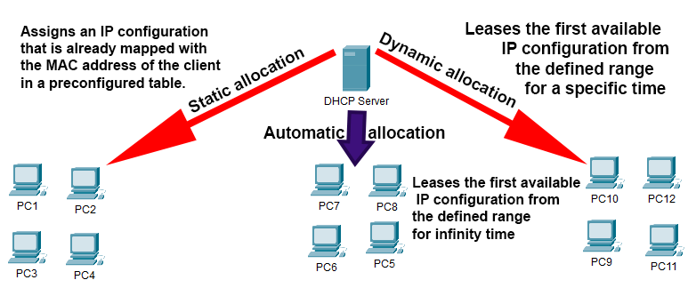

## Static Allocation静态配置

* In this method, the administrator configures the allocation table on the DHCP server

  每台客户端都有一个固定的IP地址，服务器手动为每台客户端配置该地址。
* The administrator fills in the MAC addresses of all clients and assigns  an IP configuration to each client
* The DHCP server uses the allocation table to provide IP configurations. When a client requests an IP, the server checks the table and finds a  match. If a match is found the DHCP server offers the client an IP address.

## Dynamic Allocation动态配置

* In this method, the administrator configures a range of IP addresses  on the DHCP server

  管理员在DHCP服务器上配置一个IP地址范围
* The server assigns an IP configuration from the configured range to each client that requests an IP configuration

  服务器将配置范围内的IP配置分配给请求IP配置的每个客户端
* In this method the DHCP server offers the IP configuration only for a specific time - this is called a LEASE

  DHCP服务器只提供特定时间的IP配置-这称为租约
* After the lease expires the client will need to request a new  configuration and new IP address

  租约到期后，客户端需要请求一个新的配置和新的IP地址

# Working Principles of DHCP

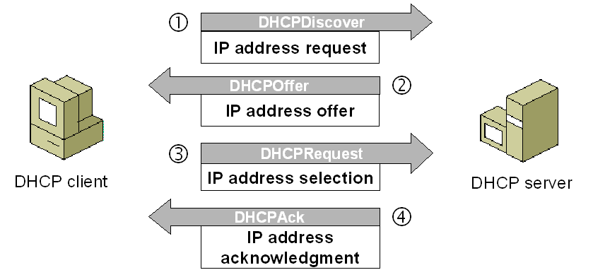

## DHCP Discovery

* When we start a device, it checks whether a valid IP configuration is  available or not. if not, the device will generate a DHCPDISCOVER  message.

  启动一个设备时，它会检查一个有效的IP配置是否可用。否则，设备将生成DHCPDISCOVER报文。
* This is a broadcast message sent out over the local area network segment.

  通过局域网段发送的广播消息
* To broadcast the message, the device uses 0.0.0.0 and 255.255.255.255 as the source and destination addresses respectively
* These addresses are special and any address sent on 255.255.255.255  are seen by all devices.

## DHCP Offer

DHCP服务器向客户端发送分配的IP地址，子网掩码，网关地址，DNS服务器地址等信息

* If a DHCP server is configured on the local network it will receive  the broadcast message - if multiple DHCP servers are configured  they will all receive the message!

  如果在本地网络上配置了DHCP服务器，它将接收广播消息-如果配置了多个DHCP服务器，它们都将接收消息!
* You must be VERY CAREFUL to configure DHCP services correctly  or else you will have IP conflicts!
* When the DHCP receives the discovery, the server cannot directly  send the DHCPOFFER message directly to the client
* The DHCP offer message is broadcast on the network and contains:  the IP address for the client, the subnet mask, the IP address of the  default gateway, the DNS server address and TFTP address

## DHCP Request

* All hosts in the local network receive the DHCPOFFER message. The host that sent the DHCPDISCOVER message accepts the DHCPOFFER

  本网络中的所有主机都会收到DHCPOFFER报文。发送DHCPDISCOVER报文的主机接受DHCPOFFER报文
* Except for the original host, all other hosts ignore the  DHCPOFFER

  除原主机外，其他主机均忽略DHCPOFFER
* How does the host know the OFFER is for it? The offer contains the hosts MAC address
* If there are multiple DHCPOFFER messages, the host will accept  only one and tells the corresponding server with a DHCPREQUEST

  如果有多个DHCPOFFER消息，主机将只接受一个，并用DHCPREQUEST通知相应的服务器
* If only one DHCP server is available and the provided IP configuration  conflicts with the clients configuration, the client can respond with a  DHCPDECLINE message. If this happens, the DHCP server can offer  another configuration (another DHCPOFFER)

# Summary of DHCP

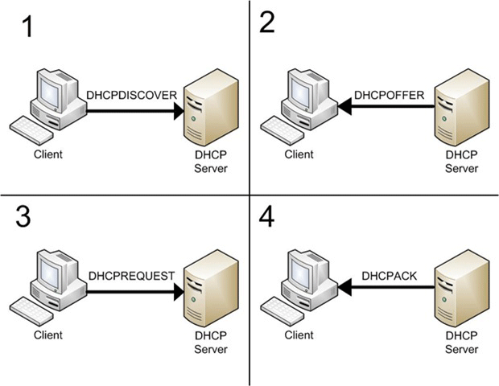

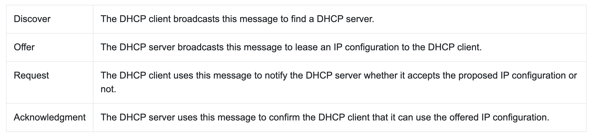

# Configuring DHCP

* To configure a DHCP server you must create and configure a DHCP pool on it.
* A DHCP pool is a collection of IP configurations assigned to DHCP  clients
* Each configuration contains a unique IP address, common network  settings, and addresses of the default gateway IP, DNS servers' IP addresses and TFTP server's IP addresses.

## IP Range

* This is the range of IP addresses assign to clients. In each range, the  first address and the last address are reserved for the network and  broadcast.

  在每个范围内，第一个地址和最后一个地址被预留给网络和广播
* DHCP clients use these to request an IP address while the DHCP  server uses it to send the DHCPOFFER

  DHCP客户端使用这些来请求IP地址，而DHCP服务器使用它来发送DHCPOFFER
* To define a range - we use the network ID and the  subnet mask.
* EXAMPLE - to define a range from 192.168.1.0 to  192.168.1.255
* We set the network ID to 192.168.1.0 and subnet  mask to 255.255.255.0

# DHCP – Reserved IP Addresses

* If you want to assign some addresses from the range you configure  them as excluded addresses. DHCP servers do not assign the exclu ded addresses
* These addresses are used to reserve IP addresses for critical devices such as:

  * Routers
  * Domain Controllers/Servers
  * Printers
* > DHCP在分配地址时，可以为特定的设备（如服务器或打印机）预留地址，以确保它们有一个稳定的IP地址。这些预留地址由网络管理员指定。
  >

# Network Resources

* Several network resources must be sent to the client
* These resources are IP address information for:

  * The local DNS server
  * The default gateway (nearest router)
  * TFTP server - allows hosts to download or store files
  * Lease duration

# DHCP Pools

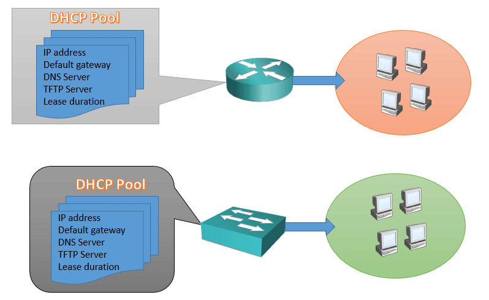

# DHCP Pool Configuration

* Cisco routers and switches include a special configuration mode  known as DHCP pool configuration mode. DHCP pool configuration  mode allows us to create and configure DHCP pools.

  > DHCP pool configuration mode是DHCP服务器配置的一种方式，用于定义并配置地址池，该地址池是用于分配给DHCP客户端的IP地址的范围。在这种模式下，管理员可以指定地址池的开始和结束地址，以及分配给客户端的IP地址的生存期。
  >
* Except the command that defines the list of excluded or reserved  addresses, all commands that are required to configure the DHCP  server run in DHCP pool configuration mode

  除定义排除或保留地址列表命令外，DHCP服务器配置所需的所有命令均在DHCP池配置模式下执行

# DHCP Relay Agents

* When a DHCP broadcast message, depending on how it is configured, it can  forward the message OR discard it immediately (default)
* When the DHCP server receives a DHCP request in the UNICAST message, it  knows that it is either forwarded by the switch/router or is a direct message  from client

  当DHCP服务器在单播消息中接收到一个DHCP请求时，它知道它要么是由交换机/路由器转发的，要么是来自客户端的直接消息
* The DHCP server uses the source address of the incoming unicast message  to determine the subnet of the client. For example, if the source address of  an incoming message is 10.0.0.1/8, then the DHCP server realizes that the  client belong to a subnet which default gateway IP must be 10.0.0.1/8

  DHCP服务器根据收到的单播报文的源地址确定客户端的子网。例如，如果收到报文的源地址为10.0.0.1/8，则DHCP服务器会认为该客户端所属的子网的默认网关必须为10.0.0.1/8

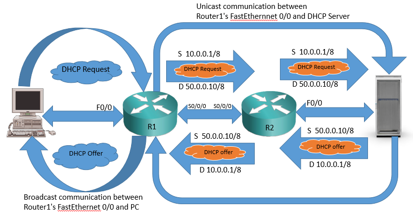

# DHCP Snooping

* DHCP snooping acts like a firewall - it inspects all  incoming messages on the port
* If an incoming message is not related to DHCP the  DHCP snooping lets it in
* If it is a DHCP message the DHCP snooping feature  goes to it's logic to determine the action
* DHCP Snooping is a feature of Cisco Layer 2 switches.
* It allows the switch to filter and block certain types of DHCP  traffic and works on a per-VLAN basis.
* By default it is not enabled, but once configured it will actively  monitor all ports for DHCP traffic.

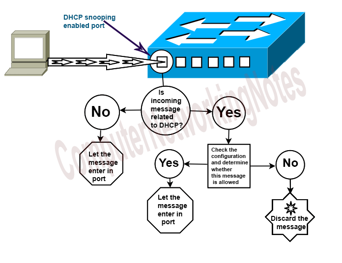

# DHCP Man-in-Middle Attack

> DHCP中间人攻击（DHCP spoofing attack）是指攻击者模拟DHCP服务器，向客户端发送伪造的DHCP报文，以配置错误的IP地址，导致客户端与网络中的其他设备通信出现故障。这种攻击可以对网络的正常通信造成严重干扰。

* In man-in-middle attack, an attacker configures a replicated DHCP  server on his device and connects that device to the local network.

  中间人攻击是指攻击者在自己的设备上配置一个复制的DHCP服务器，并将该设备连接到本地网络。
* When a client sends a request this is answered by the attackers  device.
* This answer contains modified IP configuration address information and the gateway IP address is the attackers device.

  > 此回答包含修改后的IP配置地址信息，网关IP地址是攻击者的设备。
  >
* 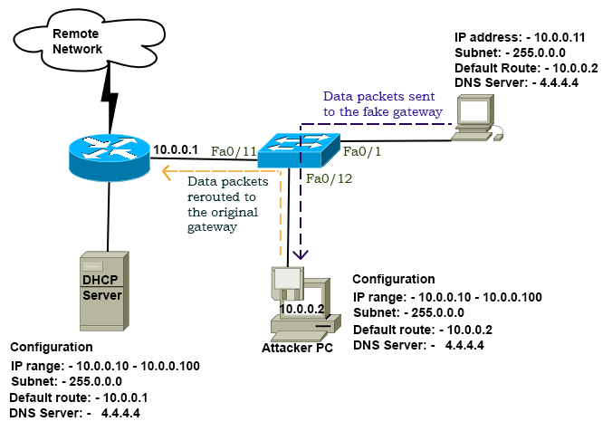

* The DHCP client never uses the Offer and Acknowledge messages.
* DHCP snooping can be configured to filter these messages on ports that are connected to DHCP clients.
* This configuration will mitigate the threat of the man-in-middle attack.
* 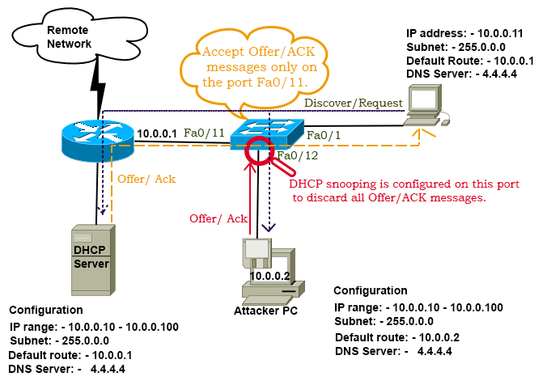

* 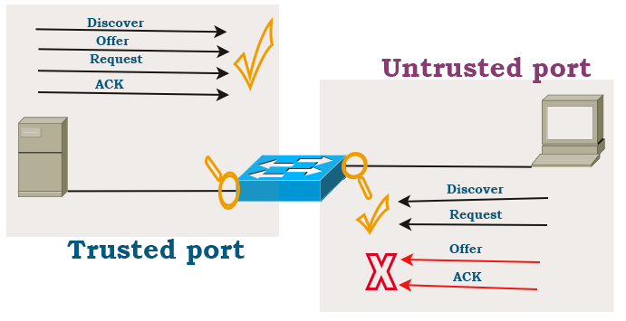

# DHCP Binding Table

* The DHCP binding table is the next level of security that the DHCP  snooping provides. DHCP snooping maintains a record of all offered /leased IP addresses in the DHCP binding table. DHCP snooping uses  this record to block DoS attacks.
* DHCP snooping uses the DHCP binding table to block this attack
* When a client broadcasts a DHCP Discovery message, the client  also includes its MAC address in the message. The DHCP server  uses the client's MAC address to provide the IP configuration to the client.
* Since a client uses a local broadcast address to send the DHCP Discovery message.  If an attacker's device is connect ed to the local network, it also receives the broadcast message .From the broadcast message,  it learns the client MAC address and uses it to make fake DHCP  requests.

  由于客户端使用本地的宽播地址发送DHCP Discovery报文。如果攻击者的设备连接到本地网络，它也会收到广播消息。从广播消息中，它会了解到客户端的MAC地址，并使用它来进行虚假的DHCP请求。

  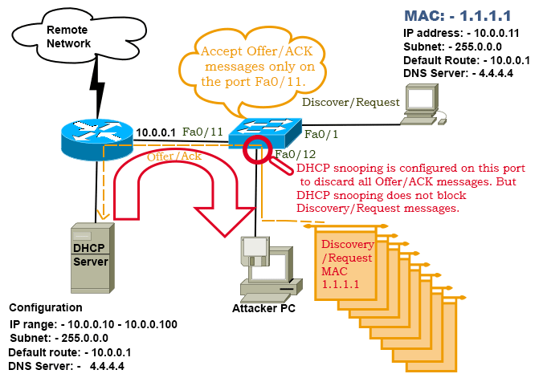

‍
